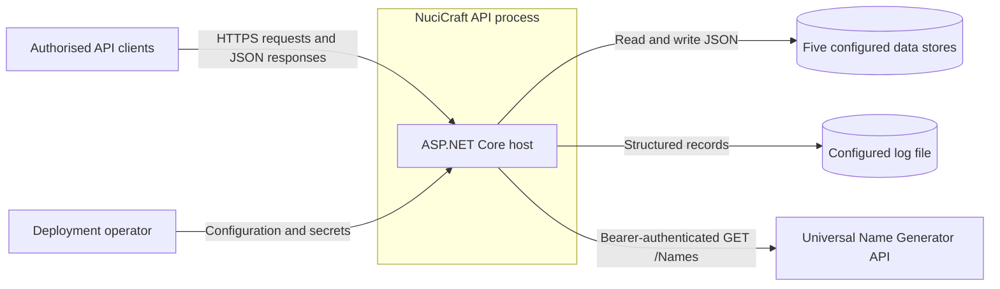
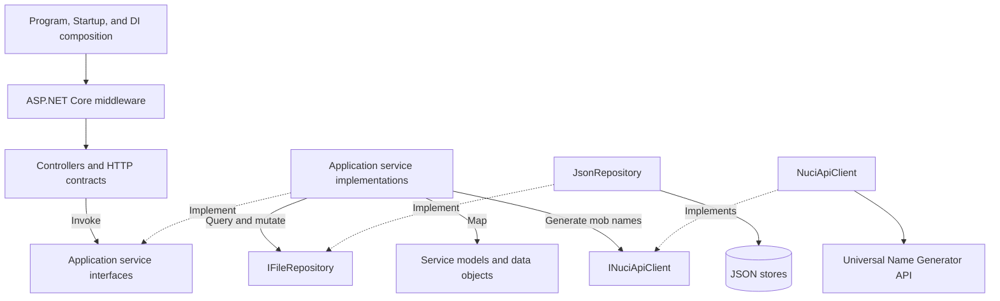
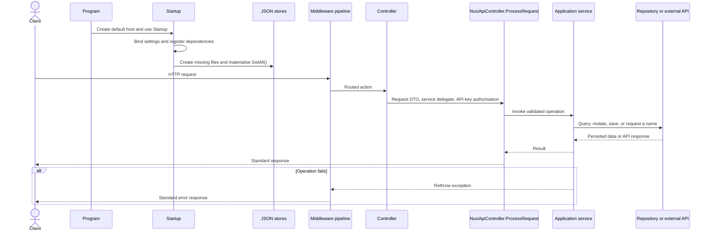
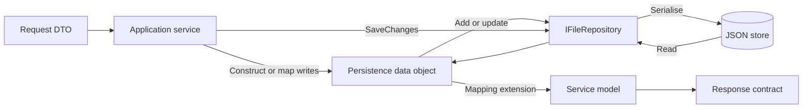
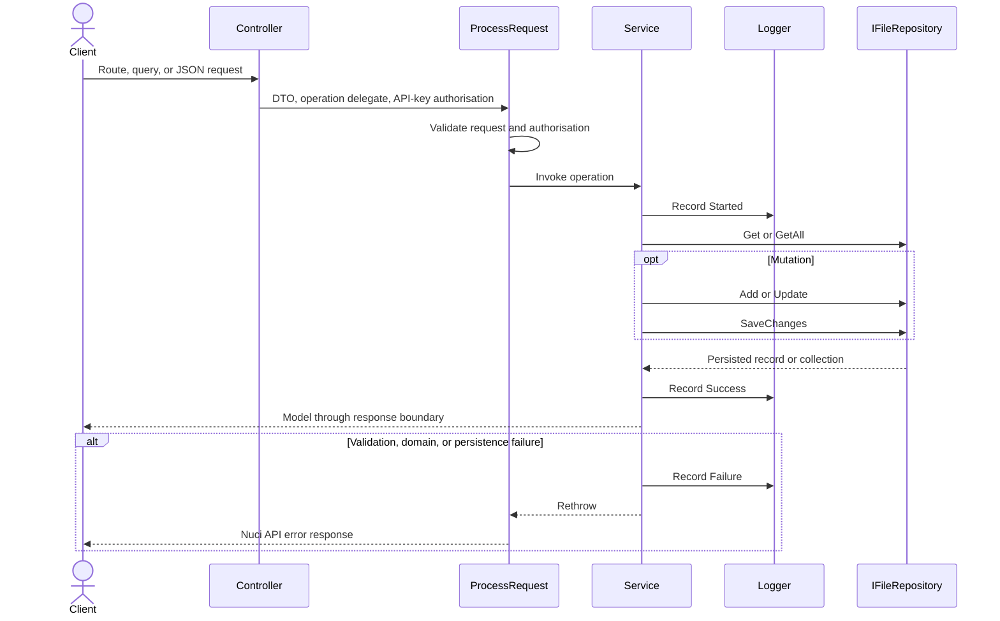
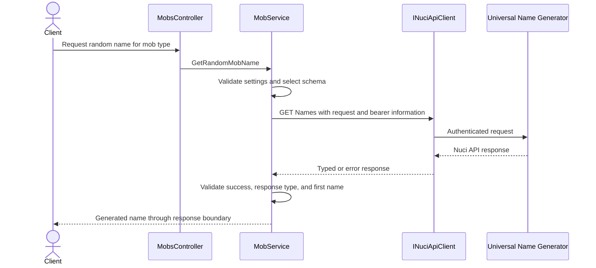
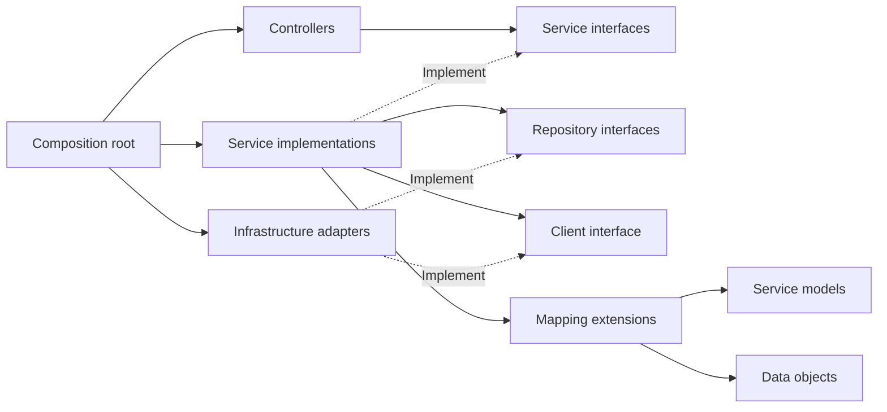

# NuciCraft API Architecture

This document records the verified current architecture of the NuciCraft API process, including its HTTP boundary, application services, persistence, external name-generation integration, and operational constraints. It is intended for contributors and operators evaluating the impact of a modification; it does not define a target architecture or duplicate endpoint usage guidance. Last verified: 27 August 2026.

## 📑 Table of Contents

- [Table of Contents](#table-of-contents)
- [Purpose](#purpose)
- [System Context](#system-context)
- [Architectural Style](#architectural-style)
- [Runtime Flow](#runtime-flow)
- [Components](#components)
- [Architectural Areas](#architectural-areas)
    - [Host Composition](#host-composition)
    - [HTTP Boundary](#http-boundary)
    - [Application Services](#application-services)
    - [Persistence Boundary](#persistence-boundary)
- [Data Architecture](#data-architecture)
- [Interfaces and Integrations](#interfaces-and-integrations)
- [Key Flows](#key-flows)
    - [File-Backed Domain Request](#file-backed-domain-request)
    - [Mob Name Generation](#mob-name-generation)
- [Domain Invariants](#domain-invariants)
    - [Zone Bounds](#zone-bounds)
    - [RTP Location Proximity](#rtp-location-proximity)
- [Cross-Cutting Concerns](#cross-cutting-concerns)
    - [Security and Privacy](#security-and-privacy)
    - [Error Handling](#error-handling)
    - [Observability](#observability)
    - [Configuration](#configuration)
    - [Concurrency and Resource Use](#concurrency-and-resource-use)
- [Dependency Direction and Rules](#dependency-direction-and-rules)
- [External Dependencies](#external-dependencies)
- [Deployment and Operations](#deployment-and-operations)
- [Compatibility Contracts](#compatibility-contracts)
- [Testing and Verification](#testing-and-verification)
- [Design Constraints](#design-constraints)
- [Extension Points](#extension-points)
    - [Add a File-Backed Domain](#add-a-file-backed-domain)
    - [Replace File Persistence](#replace-file-persistence)
- [Source Map](#source-map)
- [Related Documentation](#related-documentation)

## 🎯 Purpose

NuciCraft API provides authenticated HTTP operations for NuciCraft player registration, world, country, and zone metadata, random-teleport locations, and mob-name generation. This document defines the process boundary, runtime ownership, dependency direction, persisted contracts, and material constraints that contributors must preserve. Recording these boundaries permits modifications to be assessed without requiring every contributor to reconstruct host composition and data flow from individual classes.

## 🌐 System Context

The system boundary is one `NuciCraft.API` ASP.NET Core process. Authorised API clients initiate requests, while deployment operators provide configuration, secrets, writable storage, and network access. The process owns its HTTP responses and JSON schemas, writes operational records through NuciLog, and contacts the Universal Name Generator only for mob-name requests.



The principal external boundaries are:
- **Authorised API clients:** Supply route, query, and JSON request data plus an API-key credential; they receive Nuci API success or error contracts.
- **Deployment environment:** Supplies settings and secret values through the standard ASP.NET Core configuration boundary without committing genuine credentials.
- **Filesystem:** Stores application-owned JSON records and optional file logs; the operator owns path permissions, durability, backup, and access control.
- **Universal Name Generator API:** Accepts an outbound bearer-authenticated name request and owns remote availability and response production.

## 🏗️ Architectural Style

NuciCraft API is a layered modular monolith with interface-based adapters at its persistence and outbound HTTP boundaries. One project and process contain every runtime domain, while controllers, service interfaces, service implementations, mapping extensions, and persistence records provide explicit ownership boundaries. The domains are not independently deployable and share host composition, middleware, configuration, logging, and filesystem infrastructure.



The principal architecture boundaries are:
- **HTTP boundary:** Controllers and transport contracts own routes, payload validation metadata, response wrappers, and delegation through `ProcessRequest`; they may depend upon service interfaces but not repositories.
- **Application boundary:** Services own domain validation, selection, mutation, mapping orchestration, outbound requests, and operation logging.
- **Persistence boundary:** Data objects and `IFileRepository<T>` own serialisable representation and store access; they do not define the public HTTP contract.
- **Composition boundary:** `Program`, `Startup`, and `ServiceCollectionExtensions` select concrete middleware, settings, clients, repositories, service implementations, and lifetimes.

## 🔄 Runtime Flow



The principal runtime sequence is:
1. [Program.cs](./NuciCraft.API/Program.cs) creates the default ASP.NET Core host and delegates composition to [Startup.cs](./NuciCraft.API/Startup.cs).
2. `ConfigureServices` adds controllers, binds strongly typed settings, registers scanner protection, and registers the repositories, clients, services, utilities, and logger.
3. `Configure` prepares all five JSON stores before accepting requests: missing parent directories and files are created, then each repository is resolved and materialised through `GetAll().ToList()`.
4. The middleware pipeline executes exception handling, scanner protection, request logging, the Development-only exception page, HTTPS redirection, default files, static files, routing, authorisation, and controller endpoints in that order.
5. A controller constructs or receives a request DTO and delegates through `ProcessRequest` with a service operation and API-key authorisation descriptor.
6. The service logs the operation, executes domain logic, and accesses either an `IFileRepository<T>` or `INuciApiClient`.
7. File-backed mutations call `SaveChanges` synchronously; mob-name requests synchronously await the external client's asynchronous operation.
8. Success returns through the Nuci response boundary, while services log and rethrow failures for the exception middleware to translate.

Store preparation precedes middleware construction and is not itself middleware. Invalid paths, insufficient permissions, or unreadable store data can therefore prevent startup.

## 🧩 Components

| Component | Responsibility | Principal Dependencies | Lifetime or Ownership |
|-----------|----------------|------------------------|-----------------------|
| `Program` and `Startup` | Construct the host, register the request pipeline, and prepare stores. | ASP.NET Core, configuration, DI container, `DataStoreSettings`. | One composition root per process. |
| Controllers | Own routes, assemble request DTOs, select service operations, and delegate authorisation and response processing. | `NuciApiController`, service interfaces, `SecuritySettings`. | Framework-created request handlers. |
| `PlayerService` | Register, retrieve, list, and patch players through identifier, username, offline UUID, or online UUID selectors. | Player repository and logger. | Singleton. |
| `WorldService` | Add, retrieve, list, and patch world metadata, including merged localised values. | World repository and logger. | Singleton. |
| `CountryService` | Add, retrieve, list, and patch country metadata, including merged localised values. | Country repository, logger. | Singleton. |
| `ZoneService` | Add, retrieve, list, patch, and delete zones while enforcing bounds and localised merge rules. | Zone repository, logger. | Singleton. |
| `RtpLocationService` | Enforce proximity rules, persist RTP locations, and select random filtered locations. | RTP repository, `RtpLocationSettings`, logger. | Singleton. |
| `MobService` | Map supported mobs to schemas and obtain one name from the external generator. | `INuciApiClient`, `UniversalNameGeneratorSettings`, logger. | Singleton. |
| `JsonRepository<T>` | Provide file-backed `IFileRepository<T>` operations for one data-object type. | NuciDAL, configured store path. | One singleton per store. |
| `NuciApiClient` | Send typed requests to the Universal Name Generator API. | Configured base URL and per-request bearer information. | Singleton. |
| `NuciLogger` | Emit structured operation records consumed by services and request middleware. | NuciLog settings. | Scoped registration; consumed by singleton services. |

## 🗂️ Architectural Areas

### Host Composition

Paths:
- [NuciCraft.API/Program.cs](./NuciCraft.API/Program.cs)
- [NuciCraft.API/Startup.cs](./NuciCraft.API/Startup.cs)
- [NuciCraft.API/ServiceCollectionExtensions.cs](./NuciCraft.API/ServiceCollectionExtensions.cs)
- [NuciCraft.API/Configuration](./NuciCraft.API/Configuration/)

Responsibilities:
- Construct the ASP.NET Core host and middleware pipeline.
- Bind configuration, select concrete adapters, define lifetimes, and initialise file stores.

Boundary rules:
- Concrete infrastructure selection belongs at this composition boundary.
- Store preparation must remain consistent with every registered file repository.

### HTTP Boundary

Paths:
- [NuciCraft.API/Controllers](./NuciCraft.API/Controllers/)
- [NuciCraft.API/Requests](./NuciCraft.API/Requests/)
- [NuciCraft.API/Responses](./NuciCraft.API/Responses/)

Responsibilities:
- Define attribute routes, transport payloads, validation metadata, response wrappers, and API-key authorisation descriptors.
- Translate route and query values into request DTOs before invoking application services.

Boundary rules:
- Controllers depend upon service interfaces and must not access repositories directly.
- Persistence data objects must not become public request or response contracts.

### Application Services

Paths:
- [NuciCraft.API/Service](./NuciCraft.API/Service/)
- [NuciCraft.API/Service/Helpers](./NuciCraft.API/Service/Helpers/)
- [NuciCraft.API/Service/Mapping](./NuciCraft.API/Service/Mapping/)
- [NuciCraft.API/Service/Models](./NuciCraft.API/Service/Models/)
- [NuciCraft.API/Logging](./NuciCraft.API/Logging/)

Responsibilities:
- Own domain invariants, queries, mutations, outbound orchestration, model conversion, and structured operation logging.
- Present stable service interfaces to controllers.

Boundary rules:
- Services may depend upon repository, client, logger, utility, and settings abstractions selected by the composition root.
- Mapping extensions isolate service models from persistence-specific timestamp and nested-object representations.

### Persistence Boundary

Paths:
- [NuciCraft.API/DataAccess/DataObjects](./NuciCraft.API/DataAccess/DataObjects/)
- [NuciCraft.API/Data](./NuciCraft.API/Data/)

Responsibilities:
- Define JSON-serialisable records and retain player, world, country, zone, and RTP location state.
- Persist service mutations when `SaveChanges` is invoked.

Boundary rules:
- Each store has one configured record type and one singleton repository registration.
- The process must prepare every configured store before requests are accepted.

## 💾 Data Architecture

Transport DTOs are owned by the HTTP boundary. Application services either construct persistence records directly or use mapping extensions to translate between data objects and service models. NuciDAL repositories own file access, while the application owns each record schema and the point at which `SaveChanges` is invoked. No independent application cache or data-migration mechanism is configured in this repository.



| Data or Store | Owner | Representation and Storage | Lifecycle or Consistency |
|---------------|-------|----------------------------|--------------------------|
| `players.json` | `PlayerService` | `PlayerDataObject` records at `Data/players.json` by default. | Created during registration and patched synchronously; selectors include identifier, username, offline UUID, and online UUID. |
| `worlds.json` | `WorldService` | `WorldDataObject` records at `Data/worlds.json` by default. | Added and patched synchronously; provided localised properties merge with persisted values. |
| `countries.json` | `CountryService` | `CountryDataObject` records at `Data/countries.json` by default. | Added and patched synchronously; provided localised properties merge with persisted values. |
| `zones.json` | `ZoneService` | `ZoneDataObject` records at `Data/zones.json` by default. | Added, patched, and deleted synchronously; bounds are validated and canonicalised on writes and reads. |
| `rtp_locations.json` | `RtpLocationService` | `RtpLocationEntity` records at `Data/rtp_locations.json` by default. | Append-oriented additions after proximity validation; reads select a random optional world/biome match. |
| Operational logs | NuciLog | Structured records with optional file output at the configured log path. | Services emit started, success, and failure records; retention and access control belong to the operator. |

At startup, missing parent directories and store files are created, absent files receive `[]`, and every repository is resolved and queried. Persisted timestamps use invariant-culture strings; mapping extensions expose typed `DateTimeOffset` values where applicable. Writes are synchronous, and there is no application-level transaction across multiple stores.

## 🔌 Interfaces and Integrations

| Interface or Integration | Direction | Contract | Owner | Failure Semantics |
|--------------------------|-----------|----------|-------|-------------------|
| NuciCraft HTTP API | Inbound | ASP.NET Core attribute routes rooted at `[controller]`, JSON request/response contracts, and API-key authorisation passed to `ProcessRequest`. | Controllers and request/response DTOs. | Validation and authorisation failures remain within the Nuci controller boundary; uncaught service failures reach exception middleware. |
| JSON stores | Bidirectional | `IFileRepository<T>` operations over one configured file per data-object type. | `Startup`, application services, and NuciDAL adapters. | Invalid paths or initial reads can prevent startup; operation failures are logged and rethrown. |
| Universal Name Generator API | Outbound | Typed GET request to `Names` with one schema, count of one, and bearer authorisation. | `MobService` through `INuciApiClient`. | Unsuccessful, unexpected, or vacant responses become `InvalidOperationException`; no local retry or fallback is configured. |
| ASP.NET Core configuration | Inbound | Strongly typed sections bound by `ServiceCollectionExtensions`. | Composition root and settings classes. | Invalid store settings surface during startup; mob settings are checked when name generation is requested. |

## 🔀 Key Flows

### File-Backed Domain Request



Controllers assemble transport requests but do not own domain mutation. The selected singleton service validates domain invariants, accesses its repository, and explicitly persists mutations. Reads are mapped into service models before response wrapping where required. A service records and rethrows exceptions rather than translating them into HTTP status codes itself.

### Mob Name Generation



`MobService` maps supported mob types to hard-coded schemas, creates a `GenerateNamesRequest`, and supplies `UniversalNameGeneratorSettings.ApiKey` as `NuciApiRequestAuthorisationInfo.BearerToken`. It synchronously waits for the asynchronous client with `GetAwaiter().GetResult()`. Unsupported mobs and invalid external responses terminate the request through the standard logged exception path.

## ⚙️ Domain Invariants

### Zone Bounds

Zone creation requires both opposite corners. Both corners must contain a non-vacant world and must refer to the identical world using ordinal comparison.

Zone creation also requires a non-vacant zone `World` identifier that resolves to an existing world record.

Bounds are canonicalised on creation, update, and retrieval:
- `FirstCorner` receives minimum X, maximum Y, and minimum Z.
- `SecondCorner` receives maximum X, minimum Y, and maximum Z.
- Pitch and yaw are set to zero for canonical bounds.

A bounds patch may provide one corner; `ZoneService` merges it with the persisted opposite corner before validation. Localised name, nickname, and leader-title patches preserve unspecified languages. When `CreationDate` is absent on creation, the service records the current `Europe/Bucharest` date with an uncertainty suffix, for example `2026-08-13 (?)`.

### RTP Location Proximity

Distance checks use horizontal X/Z squared Euclidean distance and compare locations only when their worlds are ordinally equal. The configured defaults are:
- At least 200 blocks from every existing location in the identical world
- At least 500 blocks from every existing location in the identical biome and world

Both limits are supplied by `RtpLocationSettings`. Addition performs linear scans over the current collection, so validation cost increases with the number of persisted locations.

## 🧵 Cross-Cutting Concerns

### Security and Privacy

Every controller constructs `NuciApiAuthorisation.ApiKey(SecuritySettings.ApiKey)` and supplies it to `ProcessRequest`. API-key enforcement therefore belongs to the external Nuci controller-processing boundary and is distinct from scanner-protection middleware. The host invokes `UseAuthorization`, but this repository does not configure a separate ASP.NET Core authentication scheme or policy.

Request and response contracts use `HmacOrder` attributes where canonical property ordering is necessary. Signing and verification semantics belong to referenced Nuci packages and are not reimplemented locally. HTTPS redirection is active, and request DTO validation metadata constrains untrusted input before service execution.

Committed secret fields contain deployment placeholders. Production deployments must inject genuine values through protected configuration sources. API keys, player credentials, personal identifiers, IP addresses, and location data are sensitive at transport, persistence, logging, and backup boundaries.

### Error Handling

Application services record failure context and rethrow exceptions. Nuci API exception middleware owns the outer translation into an HTTP error contract. Domain validation can raise argument exceptions, missing records propagate repository failures, unsupported mob types raise `NotImplementedException`, and external response failures become `InvalidOperationException`.

Store preparation executes during startup; an invalid path, insufficient permissions, or unreadable data can terminate host initialisation. Request operations have no local retry, fallback, or partial-degradation policy.

### Observability

Nuci API request-logging middleware records inbound request activity, while services emit structured NuciLog operations using `MyOperation`, `MyLogInfoKey`, and started, success, or failure statuses. File output and its path are controlled by `nuciLoggerSettings`.

Some records contain usernames, UUIDs, IP addresses, coordinates, and identifiers. Operators must restrict log access and retention accordingly. The repository defines no metrics, distributed traces, audit store, or health endpoint, so operational visibility is limited to logs and process responses.

### Configuration

The default ASP.NET Core host supplies file, environment, and command-line configuration providers. [appsettings.json](./NuciCraft.API/appsettings.json) defines the committed defaults and deployment placeholders.

| Configuration Area | Source | Responsibility | Override or Secret Policy |
|--------------------|--------|----------------|---------------------------|
| `dataStoreSettings` | `appsettings.json` and default host providers. | Select five JSON store paths. | May be overridden per deployment; paths must resolve to protected writable storage. |
| `rtpLocationSettings` | `appsettings.json` and default host providers. | Select general and same-biome proximity limits. | Non-secret operational values may be overridden per environment. |
| `securitySettings` | Deployment placeholder and default host providers. | Supply inbound API-key authorisation material. | Genuine values must originate from a protected secret source. |
| `universalNameGeneratorSettings` | Deployment placeholders and default host providers. | Supply the external base URL and bearer token. | The base URL is environmental; the API key must originate from a protected secret source. |
| `nuciLoggerSettings` | `appsettings.json` and default host providers. | Select log-file path and file-output activation. | Operators own destination permissions, access, and retention. |

### Concurrency and Resource Use

The six application services, five repositories, outbound client, settings, and text utilities are singleton registrations. They can be reached by concurrent requests and must not acquire unprotected request-specific mutable state. The logger is registered as scoped but consumed by singleton services, so code must not presume that those service-held logger references provide per-request identity.

Repository writes and the outbound mob-name wait are synchronous from the service contract's perspective. No application-level locking or cross-instance coordination is present. RTP addition performs linear scans, and each process has independent singleton repository instances; these constraints favour one process and modest data volumes.

## 🧭 Dependency Direction and Rules

The composition root may reference every concrete runtime component because it selects implementations and lifetimes. At request time, dependencies proceed from controllers to service interfaces, from service implementations to repository or client abstractions, and from those abstractions to adapters selected in `ServiceCollectionExtensions`. Mapping extensions connect service models and persistence records without making either representation the other's public contract.



The principal dependency rules are:
- Concrete adapter construction and lifetime selection belong in `ServiceCollectionExtensions` and `Startup`.
- Controllers may depend upon service interfaces and transport contracts, but must not depend upon repositories or persistence data objects.
- Services own domain logic and may depend upon repository, client, logger, utility, and settings abstractions.
- Persistence data objects and service models may be translated only at the service or mapping boundary; neither representation may replace public HTTP contracts implicitly.
- Cross-cutting request policies belong in middleware or shared Nuci abstractions rather than duplicated controller logic.
- Infrastructure adapters must not acquire dependencies upon controllers.

## 📦 External Dependencies

| Dependency | Responsibility | Integration Boundary | Architectural Consequence |
|------------|----------------|----------------------|---------------------------|
| .NET 10 and ASP.NET Core | Host process, dependency injection, configuration, middleware, routing, controller activation, and JSON transport. | `Program`, `Startup`, controllers, and project manifest. | The deployment requires a compatible .NET 10 runtime and follows ASP.NET Core lifecycle semantics. |
| NuciAPI package family | Base request/response contracts, controller processing, outbound API client, scanner protection, request logging, and exception handling. | HTTP boundary, middleware pipeline, and `MobService`. | Authorisation and error-contract details partly reside outside this repository and vary with package upgrades. |
| NuciDAL | `IFileRepository<T>` and `JsonRepository<T>` persistence. | Service repository dependencies and DI registrations. | Persistence semantics and file serialisation are coupled to the selected NuciDAL version. |
| NuciLog | Structured logger, operation statuses, and configurable file output. | Request middleware and application services. | Operational visibility depends upon logger configuration and protection of potentially sensitive context. |
| NuciSecurity.HMAC | Canonical request and response property-order metadata. | Attributes on transport contracts. | Property ordering is a compatibility-sensitive contract even though signing semantics are external. |
| Universal Name Generator API | Remote generation of names for supported mob categories. | `MobService` through `INuciApiClient`. | Name requests depend upon external latency, availability, schemas, and valid bearer credentials. |

## 🚀 Deployment and Operations

The deployment unit is one .NET 10 ASP.NET Core process containing every controller, service, repository, and integration adapter. It requires protected configuration, writable durable storage for four JSON stores, optional writable log storage, and outbound network access to the Universal Name Generator. The repository defines no database, message broker, distributed cache, container manifest, OpenAPI interface, or health endpoint.

| Concern | Current Design | Architectural Consequence |
|---------|----------------|---------------------------|
| Process topology | One modular-monolith process. | Domains share availability, memory, configuration, and deployment cadence. |
| Persistent state | Five independently configured JSON files. | The operator must provide writable durable paths, coherent backups, and restricted access. |
| Startup | Creates missing directories and files, then queries every repository before serving requests. | Invalid paths, permissions, or unreadable data can prevent process startup. |
| Scaling | No distributed locking, invalidation, or cross-instance coordination is configured. | The supported topology is one process; multiple writers can produce stale reads or overwritten state. |
| External connectivity | Mob-name requests call the Universal Name Generator synchronously from the service contract. | Remote latency and failure affect the initiating request; no local fallback exists. |
| Diagnostics | Request and operation logs, with optional file output. | Operators must monitor process and log outputs without a repository-defined health or metrics endpoint. |
| Release | [release.sh](./release.sh) downloads and executes an external .NET 10 release helper. | Release execution requires network access and prior inspection of externally supplied script content. |

## 🛡️ Compatibility Contracts

| Contract | Owner | Invariant | Verification | Change Policy |
|----------|-------|-----------|--------------|---------------|
| HTTP routes and payloads | Controllers and request/response DTOs. | Unversioned route shapes, JSON property names, required values, and response wrappers remain coherent for clients. | Controller, request, and response tests. | Preserve the public contract unless an incompatible modification is intentional, documented, and coordinated. |
| HMAC property order | Request and response DTOs. | `HmacOrder` values retain the canonical sequence expected by Nuci security consumers. | Contract tests and attribute review. | Alter only with coordinated client and server compatibility validation. |
| JSON record schemas | Data objects and mapping extensions. | Identifiers, nested values, and invariant-culture timestamps remain readable by the configured repositories and mappers. | Mapping tests and startup repository tests. | Introduce an explicit data migration before an incompatible persisted-shape modification. |
| Zone bounds | `ZoneService`. | Canonical first and second corners retain their minimum/maximum axis orientation and identical-world requirement. | Zone service and mapping tests. | Preserve read and write canonicalisation or migrate every producer and consumer together. |
| Configuration sections | Settings classes and `ServiceCollectionExtensions`. | Section names and required values continue to bind into the composition root. | Service-collection and startup tests. | Coordinate key revisions with every deployment configuration and documentation source. |

## ✅ Testing and Verification

The [NuciCraft.API.UnitTests](./NuciCraft.API.UnitTests/) project mirrors production areas and uses NUnit, Moq, and the Microsoft .NET test SDK. Root fixtures verify host and service registration, controller fixtures verify routes, request construction, authorisation, and delegation, service fixtures isolate repositories and logging, and mapping fixtures invoke internal extension methods through `MappingMethodInvoker`.

The suite verifies domain success and failure paths, store preparation, response contracts, and logging enumerations. It does not provide a separate end-to-end or integration-test project. Real concurrent file access, complete external middleware semantics, deployment configuration, and live Universal Name Generator availability therefore remain integration verification gaps.

Execute the principal automated verification with:

```bash
dotnet test NuciCraft.API.slnx
```

## ⚠️ Design Constraints

- **File-Backed Persistence:** JSON stores minimise operational dependencies but provide no application-level transaction across files and restrict concurrent writer safety.
- **Single-Process Consistency:** Process-lifetime repositories have no distributed coordination, so horizontal scale-out is not a supported consistency model.
- **Synchronous Service Contracts:** Repository persistence and the wait on outbound HTTP occupy request threads until completion.
- **Singleton Lifetime Graph:** Application services and repositories are singleton registrations, while the logger is scoped; service-held dependencies must not presume request-specific mutable identity.
- **Linear RTP Validation:** Each RTP addition scans current locations for general and same-biome proximity, causing validation cost to increase linearly with stored volume.
- **Hard-Coded Name Schemas:** Mob-to-schema mappings are compiled into `MobService`, so schema revisions require a code modification and deployment.
- **Unversioned HTTP Routes:** The API has no explicit version segment or policy, which increases coordination requirements for incompatible contract changes.
- **External Package Boundaries:** Controller processing, repository internals, logging sinks, and middleware response details are supplied by versioned Nuci packages and are not fully visible to local tests.

## 🔧 Extension Points

### Add a File-Backed Domain

1. Define request and response contracts at the HTTP boundary and a service interface at the application boundary.
2. Implement domain rules in a service and introduce service models only where they clarify the persistence boundary.
3. Add a data object, mapping extensions, a configured store path, and an `IFileRepository<T>` registration.
4. Extend `Startup` store preparation for the new repository and add controller actions that delegate through `ProcessRequest` with API-key authorisation.
5. Add focused controller, service, mapping, configuration, and startup tests.

Follow the existing plural controller naming, interface-to-implementation registration, singleton service and repository lifetimes, explicit `SaveChanges` calls, timestamp format, and structured operation logging conventions.

### Replace File Persistence

1. Define a repository contract and data-migration plan that preserve service query, mutation, identifier, and timestamp semantics.
2. Register the replacement adapters in `ServiceCollectionExtensions` and revise or eliminate the file-specific preparation in `Startup`.
3. Migrate existing records and add integration verification for consistency, concurrency, failure translation, and deployment configuration.

The current `IFileRepository<T>` boundary is file-oriented. A database adapter must either honour that contract completely or revise dependent services as one coordinated architectural modification; registering a novel adapter alone is insufficient while `Startup` still assumes file paths.

## 🗺️ Source Map

| Area | Path |
|------|------|
| Solution membership | [NuciCraft.API.slnx](./NuciCraft.API.slnx) |
| Host entry and composition | [NuciCraft.API/Program.cs](./NuciCraft.API/Program.cs), [NuciCraft.API/Startup.cs](./NuciCraft.API/Startup.cs), [NuciCraft.API/ServiceCollectionExtensions.cs](./NuciCraft.API/ServiceCollectionExtensions.cs) |
| Runtime dependencies | [NuciCraft.API/NuciCraft.API.csproj](./NuciCraft.API/NuciCraft.API.csproj) |
| Configuration contracts | [NuciCraft.API/Configuration](./NuciCraft.API/Configuration/), [NuciCraft.API/appsettings.json](./NuciCraft.API/appsettings.json) |
| HTTP boundary | [NuciCraft.API/Controllers](./NuciCraft.API/Controllers/), [NuciCraft.API/Requests](./NuciCraft.API/Requests/), [NuciCraft.API/Responses](./NuciCraft.API/Responses/) |
| Application services | [NuciCraft.API/Service](./NuciCraft.API/Service/) |
| Models and mappings | [NuciCraft.API/Service/Models](./NuciCraft.API/Service/Models/), [NuciCraft.API/Service/Mapping](./NuciCraft.API/Service/Mapping/) |
| Persistence records and stores | [NuciCraft.API/DataAccess/DataObjects](./NuciCraft.API/DataAccess/DataObjects/), [NuciCraft.API/Data](./NuciCraft.API/Data/) |
| Logging vocabulary | [NuciCraft.API/Logging](./NuciCraft.API/Logging/) |
| Automated tests | [NuciCraft.API.UnitTests](./NuciCraft.API.UnitTests/) |
| Release entry point | [release.sh](./release.sh) |

## 📚 Related Documentation

- [README.md](./README.md) describes capabilities, endpoint usage, configuration keys, development commands, project structure, and contribution guidance.
- [SECURITY.md](./SECURITY.md) defines supported release channels, vulnerability scope, reporting, disclosure, and safe-harbour policy.