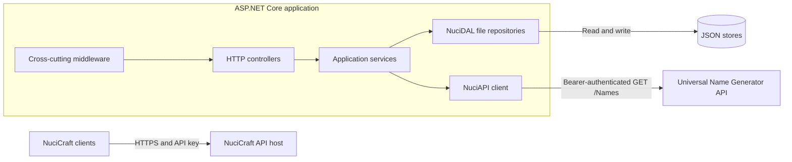
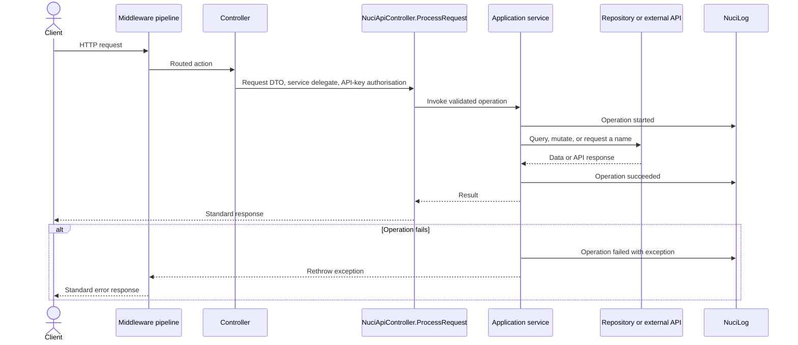

# NuciCraft API Architecture

Last verified: 13 August 2026

NuciCraft API is a .NET 10 ASP.NET Core modular monolith. It exposes Minecraft server operations through HTTP controllers, implements domain rules in application services, persists state through JSON-file repositories, and delegates mob-name generation to the Universal Name Generator API.

This document describes the implemented architecture. Endpoint examples and operator instructions remain in [README.md](./README.md), while vulnerability disclosure information remains in [SECURITY.md](./SECURITY.md).

## Architectural Goals

The current design prioritises:
- A compact service that is economical to operate for one NuciCraft server
- Explicit boundaries between transport contracts, application logic, and persisted records
- Portable persistence without a separate database service
- Consistent authorisation, logging, and error responses through the Nuci libraries
- Focused unit testing of controllers, services, mappings, and host composition

The current design does not target horizontally scaled or high-concurrency deployment. JSON files, synchronous persistence, and process-local singleton repositories are deliberate constraints of the present implementation.

## System Context



The solution contains two projects:

| Project | Responsibility |
|---------|----------------|
| [NuciCraft.API](./NuciCraft.API/) | ASP.NET Core host, controllers, contracts, application services, mappings, configuration, and file-persistence records. |
| [NuciCraft.API.UnitTests](./NuciCraft.API.UnitTests/) | NUnit and Moq tests for host composition, controllers, services, response contracts, logging metadata, and mappings. |

The solution membership is declared in [NuciCraft.API.slnx](./NuciCraft.API.slnx).

## Runtime Composition

[Program.cs](./NuciCraft.API/Program.cs) creates the default ASP.NET Core host and delegates application composition to [Startup.cs](./NuciCraft.API/Startup.cs).

### Dependency Injection

[ServiceCollectionExtensions.cs](./NuciCraft.API/ServiceCollectionExtensions.cs) registers the principal components:

| Lifetime | Components |
|----------|------------|
| Singleton | Strongly typed settings, four `IFileRepository<T>` instances, `INuciApiClient`, all five application services, and text utilities. |
| Scoped | NuciLog's `ILogger` implementation. |
| Framework managed | Controllers and ASP.NET Core infrastructure. |

Application services and repositories must remain stateless or thread-safe because they are shared for the process lifetime. The current registrations also inject a scoped logger into singleton services; any alteration to logger state or lifetime must be validated through host-composition tests.

### Startup Sequence

The host starts in the subsequent sequence:
1. The default host loads configuration and creates the web host.
2. `ConfigureServices` adds controllers, binds settings, registers scanner protection, and registers custom services.
3. `Configure` prepares all configured JSON stores before accepting requests.
4. Missing parent directories are created and missing store files are initialised to `[]`.
5. Every repository is resolved and its complete data set is materialised once through `GetAll().ToList()`.
6. The HTTP middleware pipeline and controller endpoints are registered.

Repository preparation causes invalid paths, permissions, or malformed stores to surface during application startup rather than during the first relevant request.

### Middleware Order

Middleware executes in this order:
1. Nuci API exception handling
2. Nuci API scanner protection
3. Nuci API request logging
4. ASP.NET Core developer exception page in the Development environment
5. HTTPS redirection
6. Default-file resolution
7. Static-file serving
8. Routing
9. ASP.NET Core authorisation
10. Controller endpoints

Store preparation precedes pipeline construction and is not middleware.

## Request Lifecycle



All controllers inherit from the external `NuciApiController` type and use attribute routing rooted at `[controller]`. Their responsibilities are intentionally restricted to:
- Constructing request DTOs from route, query, and body values
- Selecting an application-service operation
- Wrapping returned models in response DTOs where required
- Passing an API-key authorisation descriptor to `ProcessRequest`

Controllers do not access repositories directly. Application services own validation, selection, mutation, external calls, and structured operation logging.

## Application Layers

| Layer | Location | Responsibility |
|-------|----------|----------------|
| HTTP controllers | [Controllers](./NuciCraft.API/Controllers/) | Routes, request assembly, API-key authorisation descriptors, service invocation, and response wrappers. |
| Request and response contracts | [Requests](./NuciCraft.API/Requests/) and [Responses](./NuciCraft.API/Responses/) | HTTP payload shape, data annotations, JSON names, and canonical HMAC property order. |
| Application services | [Service](./NuciCraft.API/Service/) | Business rules, orchestration, persistence operations, and operation-level logging. |
| Service models | [Service/Models](./NuciCraft.API/Service/Models/) | In-process representations returned by services. |
| Mapping | [Service/Mapping](./NuciCraft.API/Service/Mapping/) | Translation between service models and persistence data objects. |
| Persistence records | [DataAccess/DataObjects](./NuciCraft.API/DataAccess/DataObjects/) | JSON-serialisable records consumed by `IFileRepository<T>`. |
| Configuration | [Configuration](./NuciCraft.API/Configuration/) | Strongly typed settings bound at startup. |
| Logging vocabulary | [Logging](./NuciCraft.API/Logging/) | Stable operation names and structured contextual keys. |

Dependencies proceed inward from controllers to service interfaces. Services depend upon repositories, clients, settings, and logging abstractions. Mapping extensions prevent persistence-specific timestamp and nested-object representations from leaking into controllers.

## Domain Components

| Domain | Entry Point | Service | State or Dependency | Principal Rules |
|--------|-------------|---------|---------------------|-----------------|
| Players | `PlayersController` | `IPlayerService` / `PlayerService` | `players.json` | Registers, retrieves, lists, and patches players; supports identifier, username, offline UUID, and online UUID selectors; derives Minecraft offline UUIDs during registration. |
| Countries | `CountriesController` | `ICountryService` / `CountryService` | `countries.json` | Adds, retrieves, lists, and patches country metadata; partial updates merge provided localised values with persisted values. |
| Zones | `ZonesController` | `IZoneService` / `ZoneService` | `zones.json` | Adds, retrieves, lists, and patches zones; validates and canonicalises bounds; merges partial localised values and partial bounds. |
| RTP locations | `RtpLocationsController` | `IRtpLocationService` / `RtpLocationService` | `rtp_locations.json` | Adds locations subject to distance constraints and returns a random location after optional world and biome filtering. |
| Mobs | `MobsController` | `IMobService` / `MobService` | Universal Name Generator API | Maps supported mob types to name schemas and requests one generated name. |

### Zone Invariants

Zone creation requires both opposite corners. Both corners must contain a non-vacant world and must refer to the identical world using ordinal comparison.

Bounds are canonicalised on creation, update, and retrieval:
- `FirstCorner` receives minimum X, maximum Y, and minimum Z.
- `SecondCorner` receives maximum X, minimum Y, and maximum Z.
- Pitch and yaw are set to zero for canonical bounds.

A bounds patch may provide one corner; the service merges it with the persisted opposite corner before validation. Localised name, nickname, and leader-title patches similarly preserve unspecified languages. When `CreationDate` is absent on creation, the service records the current `Europe/Bucharest` date with an uncertainty suffix, for example `2026-08-13 (?)`.

### RTP Location Invariants

Distance checks use horizontal X/Z squared Euclidean distance and compare locations only when their worlds are ordinally equal. The configured defaults are:
- At least 200 blocks from every existing location in the identical world
- At least 500 blocks from every existing location in the identical biome and world

Both limits are supplied by `RtpLocationSettings`. Addition performs linear scans over the current collection, so validation cost increases with the number of persisted locations.

## Persistence

NuciDAL's `JsonRepository<T>` implements `IFileRepository<T>` for four independently configured stores:

| Setting | Default Path | Record Type |
|---------|--------------|-------------|
| `dataStoreSettings.countriesStorePath` | `Data/countries.json` | `CountryDataObject` |
| `dataStoreSettings.playersStorePath` | `Data/players.json` | `PlayerDataObject` |
| `dataStoreSettings.rtpLocationsStorePath` | `Data/rtp_locations.json` | `RtpLocationEntity` |
| `dataStoreSettings.zonesStorePath` | `Data/zones.json` | `ZoneDataObject` |

Services mutate a repository with `Add` or `Update` and then call `SaveChanges` synchronously. Reads call `Get` or `GetAll`, after which mapping extensions produce service models. Persisted timestamps use invariant-culture strings; service models expose typed `DateTimeOffset` values where applicable.

The persistence model imposes these operational constraints:
- The process requires read and write access to every configured store and its parent directory.
- There is no application-level transaction spanning multiple store files.
- No distributed locking, cache invalidation, or cross-instance coordination is configured in this repository.
- Multiple application instances referencing the identical files can observe stale state or overwrite one another.
- Backups must preserve all store files consistently and must not expose player or location data.

The supported topology is therefore one application process with durable local or mounted storage. A database migration requires both repository-registration changes and elimination or adaptation of the file-specific preparation in `Startup`.

## External Name Generation

`MobService` uses the singleton `INuciApiClient` configured with `UniversalNameGeneratorSettings.BaseUrl`. For each supported mob type, it:
1. Selects a hard-coded Universal Name Generator schema.
2. creates a `GenerateNamesRequest` with a count of one.
3. Creates `NuciApiRequestAuthorisationInfo` with `BearerToken` sourced from `UniversalNameGeneratorSettings.ApiKey`.
4. Sends a GET request to the `Names` endpoint.
5. Rejects unsuccessful, unexpected, or vacant responses.
6. Returns the first generated name.

The underlying client API is asynchronous, but `MobService` waits synchronously with `GetAwaiter().GetResult()`. No retry, circuit-breaker, or fallback policy is configured locally. Consequently, external latency occupies a request thread and external failures propagate through the standard service logging and exception middleware path.

Mob-to-schema mappings reside in `MobService`; supporting a novel mob category or schema currently requires a code modification and deployment.

## Cross-Cutting Concerns

### Configuration

The default host supplies the standard ASP.NET Core configuration providers. [appsettings.json](./NuciCraft.API/appsettings.json) defines these application sections:

| Section | Purpose |
|---------|---------|
| `dataStoreSettings` | JSON store paths. |
| `rtpLocationSettings` | General and same-biome distance thresholds. |
| `securitySettings` | Inbound API key. |
| `universalNameGeneratorSettings` | External API base URL and bearer token. |
| `nuciLoggerSettings` | Log-file path and file-output activation. |

Secret values are represented by deployment placeholders in the committed configuration. Production deployments must inject secrets through protected configuration sources and must never persist genuine keys in source control or logs.

### Security

Every controller constructs `NuciApiAuthorisation.ApiKey(SecuritySettings.ApiKey)` and supplies it to `ProcessRequest`. API-key enforcement is therefore part of the external Nuci controller-processing boundary, distinct from scanner-protection middleware. The host also invokes `UseAuthorization`, although this repository does not configure a separate ASP.NET Core authentication scheme or policy.

Request and response contracts use `HmacOrder` attributes where canonical property ordering is necessary. Signing and verification semantics belong to the referenced Nuci packages and are not reimplemented in this repository.

HTTPS redirection is active. API keys, player credentials, personal identifiers, and stored location data must be treated as sensitive information at configuration, logging, backup, and transport boundaries.

### Logging and Errors

Application services use NuciLog with stable operations from `MyOperation` and contextual keys from `MyLogInfoKey`. The prevalent service pattern is:
1. Record `Started` with relevant context.
2. Execute the operation in a `try` block.
3. Record `Success` and return.
4. On an exception, record `Failure` and rethrow.

The outer exception middleware converts uncaught failures into the Nuci API error contract. Request logging and service logging are separate concerns.

Some operations include usernames, UUIDs, IP addresses, coordinates, and identifiers as log context. Operators must restrict log access, configure an appropriate retention period, and refrain from collecting more context than incident diagnosis requires.

## Testing Strategy

The unit-test project mirrors the production structure and uses NUnit, Moq, and the Microsoft .NET test SDK.

Test responsibilities include:
- Host and service-registration composition
- Store preparation and eager repository access
- Controller routes, request construction, authorisation, and service delegation
- Application-service success, validation, and failure paths
- Persistence-to-service model mappings, including internal extension methods invoked through `MappingMethodInvoker`
- Response contracts and logging enumeration values

Repository and logger abstractions are mocked in service tests, while controller tests provide a controlled HTTP context. The repository contains no separate end-to-end or external-service integration-test project, so package behaviour, real file concurrency, middleware integration, and Universal Name Generator availability remain integration risks.

Execute the complete suite with:

```bash
dotnet test NuciCraft.API.slnx
```

## Deployment and Operations

The API targets .NET 10 and is built and executed with:

```bash
dotnet build NuciCraft.API/NuciCraft.API.csproj
dotnet run --project NuciCraft.API/NuciCraft.API.csproj
```

A deployment must provide:
- A .NET 10 runtime
- Valid API and Universal Name Generator configuration
- Writable, durable paths for all four JSON stores
- Network access to the Universal Name Generator when mob names are requested
- HTTPS termination either in Kestrel or in correctly configured infrastructure

The repository does not define a database, message broker, distributed cache, health endpoint, OpenAPI interface, or container manifest. [release.sh](./release.sh) delegates packaging and release operations to an externally downloaded .NET 10 deployment script; operators must inspect that external script before execution.

## Architectural Constraints

The principal constraints and their consequences are:

| Constraint | Consequence | Evolution Path |
|------------|-------------|----------------|
| JSON-file repositories | Economical local operation, but restricted concurrency and no scale-out coordination. | Introduce a transactional database-backed repository abstraction and revise startup preparation. |
| Singleton services and repositories | Minimal allocation and shared process state, but all dependencies must tolerate concurrent requests. | Prefer stateless services and validate lifetimes whenever mutable dependencies are introduced. |
| Synchronous repository persistence | Simple service contracts, but request threads perform file I/O. | Introduce asynchronous repository and service contracts together. |
| Synchronous wait on external HTTP | Simple controller contract, but external latency blocks a request thread. | Propagate `Task`-based APIs from the client through service interfaces and controllers. |
| Hard-coded mob schemas | Explicit and testable mappings, but configuration changes require deployment. | Move mappings into validated configuration if operational modification becomes necessary. |
| Linear RTP proximity checks | Straightforward correctness for modest data sets. | Introduce a spatial index or database query when location volume warrants it. |
| Unversioned controller routes | Compact public API, but incompatible contract changes are difficult. | Add explicit API versioning before the first incompatible public-contract revision. |

## Extension Rules

When introducing a domain capability, preserve the current dependency direction:
1. Define request and response contracts at the HTTP boundary.
2. Define a service interface and place rules in its implementation.
3. Introduce service models only when they provide a useful boundary from persistence records.
4. Add data objects and mapping extensions for persisted state.
5. Register services, repositories, clients, and settings in `ServiceCollectionExtensions`.
6. Extend store preparation in `Startup` only for novel file repositories.
7. Add controller actions that delegate through `ProcessRequest` with API-key authorisation.
8. Add focused tests at every modified boundary.

Controllers must not contain persistence logic, and persistence data objects must not become the public HTTP contract. Cross-cutting policies belong in middleware or shared abstractions rather than duplicated controller code.