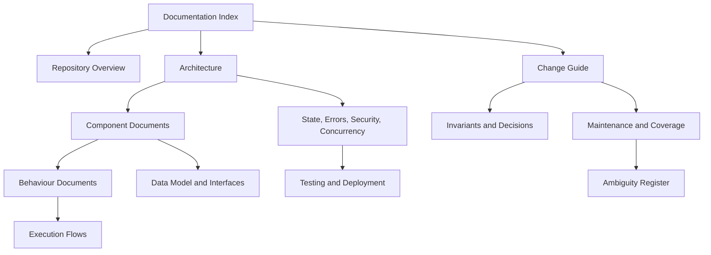

# NuciCraft API Documentation

| Metadata | Value |
|----------|-------|
| Purpose | Provide the principal navigation index for the implementation-grounded NuciCraft API knowledge base. |
| Scope | Every document under `docs/`, with task-oriented reading sequences and source-authority guidance. |
| Primary sources | [Runtime project](../NuciCraft.API/), [unit tests](../NuciCraft.API.UnitTests/), [integration tests](../NuciCraft.API.IntegrationTests/), and [repository metadata](../README.md) |
| Related documents | [Repository overview](repository-overview.md), [architecture](architecture.md), [change guide](change-guide.md), and [documentation coverage](documentation-coverage.md) |

## Repository Synopsis

NuciCraft API is one ASP.NET Core 10 process that exposes API-key-protected HTTP operations for Minecraft server metadata, Players, Homes, random-teleport locations, Countries, Worlds, ZoneTypes, Zones, and generated mob names. It persists seven record types in configured JSON files, queries a Minecraft Java server for live status, and calls the Universal Name Generator for names.

The service is a layered modular monolith. Controllers delegate to singleton application services; services use singleton NuciDAL repositories or outbound adapters; request processing, error translation, HMAC handling, scanner protection, and substantial infrastructure behaviour come from versioned Nuci packages.

## Purpose Of This Corpus

This corpus preserves the semantic knowledge otherwise reconstructed by tracing source:
- Architectural boundaries and dependency direction.
- Complete capability and request execution.
- Data representations and conversion rules.
- Persistence, state, concurrency, security, and failure semantics.
- External systems and package ownership.
- Test and deployment architecture.
- Durable decisions, invariants, ambiguities, and practical change maps.

Source code remains authoritative. Use the corpus to select the correct source slice, then verify the controlling implementation before modifying it.

## Documentation Map

### Foundation And Reference

| Document | Contents |
|----------|----------|
| [Repository Overview](repository-overview.md) | Purpose, consumers, capabilities, boundaries, inputs and outputs, lifecycle, and explicit non-responsibilities. |
| [Architecture](architecture.md) | Layers, projects, dependency direction, composition root, middleware, lifecycle, topology, and failure boundaries. |
| [Repository Structure](repository-structure.md) | Physical organisation, directory ownership, important files, generated artefacts, and placement guidance. |
| [Data Model](data-model.md) | Requests, responses, service models, data objects, configuration models, fields, relationships, defaults, mappings, and null semantics. |
| [Interfaces And Contracts](interfaces.md) | All 39 HTTP actions, internal service contracts, repository and filesystem contracts, outbound protocols, and compatibility. |
| [Configuration](configuration.md) | Sources, precedence, every key and default, environment forms, consumers, validation timing, restart, and secret handling. |
| [External Dependencies And Integrations](integrations.md) | Filesystem, Universal Name Generator, Minecraft status, Nuci packages, release helper, failures, lifecycle, and substitution. |
| [State And Persistence](state-and-persistence.md) | State inventory, store topology, transitions, save boundaries, consistency, caches, distributed limits, backup, and migration. |
| [Error Handling And Resilience](error-handling.md) | Error taxonomy, validation, translation, network and persistence failures, retries, fallback, cleanup, partial failure, and idempotency. |
| [Security Model](security.md) | Trust boundaries, authentication, authorisation, secrets, sensitive data, network and storage security, attack surfaces, and assumptions. |
| [Concurrency And Scheduling](concurrency-and-scheduling.md) | Singleton sharing, Home locking, race risks, blocking calls, ordering, cancellation, randomness, and absence of scheduled work. |
| [Testing Architecture](testing.md) | Unit and integration fixtures, test host, doubles, temporary state, coverage by boundary, commands, and verified gaps. |
| [Build, Deployment, And Operations](build-and-deployment.md) | Restore, compile, test, run, publish, CI, remote release, runtime requirements, readiness, shutdown, and rollback. |
| [Dependencies](dependencies.md) | Package versions, architectural roles, encapsulation, transitive use, and replacement or upgrade consequences. |
| [Cross-Cutting Concerns](cross-cutting-concerns.md) | Logging, validation, serialisation, HMAC, DI, mapping, localisation, time, identifiers, HTTP, filesystem, telemetry, and disposal. |
| [Design Decisions](design-decisions.md) | Evidence-based architectural choices, consequences, and constraints, with unknown historical rationale labelled. |
| [Invariants And Rules](invariants.md) | System-wide identifier, timestamp, domain, persistence, comparison, contract, and external-service rules. |
| [Ambiguities And Open Questions](ambiguities-and-open-questions.md) | Material external, historical, package, contract, and deployment unknowns that must not be presented as fact. |

### Components

| Document | Architectural Unit |
|----------|--------------------|
| [Host And Composition](components/host-and-composition.md) | Process entry, service registration, settings binding, store preparation, middleware, and lifecycle. |
| [HTTP API Boundary](components/http-api-boundary.md) | Controllers, routes, binding, API-key hand-off, HMAC metadata, and success contracts. |
| [Persistence And Mapping](components/persistence-and-mapping.md) | NuciDAL boundary, seven stores, data objects, mappings, timestamps, and merge helpers. |
| [Player And Homes](components/player-and-homes.md) | Player identity, settings, selectors, personal data, Home ownership, localisation, uniqueness, and locking. |
| [Geographic Metadata](components/geographic-metadata.md) | Country, World, ZoneType, Zone, references, bounds, containment, filtering, and web-map enrichment. |
| [RTP Locations](components/rtp-locations.md) | Spatial exclusion algorithm, storage, optional filters, random selection, and race implications. |
| [External Services](components/external-services.md) | Universal Name Generator schemas and Java server-status protocol, timeouts, fallback, and errors. |

### Runtime Behaviour

| Document | Capability Group |
|----------|------------------|
| [Player And Home Capabilities](behaviour/player-and-home-capabilities.md) | Every Player and Home operation with conditions, branches, state effects, outputs, and failures. |
| [Geographic Metadata Capabilities](behaviour/geographic-metadata-capabilities.md) | Country, World, ZoneType, and Zone operation conduct. |
| [RTP And External Capabilities](behaviour/rtp-and-external-capabilities.md) | RTP addition and selection, mob names, and server information. |

### End-To-End Flows

| Document | Trace |
|----------|-------|
| [Process Startup](flows/startup.md) | `Program.Main` through settings, DI, store creation, eager loads, middleware, and readiness. |
| [File-Backed Request](flows/file-backed-request.md) | Shared controller, processor, service, repository, mapping, response, and error sequence. |
| [Player And Home Requests](flows/player-and-home-requests.md) | Registration, patching, selectors, Home lock, uniqueness, and query branches. |
| [Zone Requests](flows/zone-requests.md) | Reference validation, bounds, patch merge, filters, containment, enrichment, and delete. |
| [External Requests](flows/external-requests.md) | Mob-name HTTP and Minecraft Java TCP sequences. |

### Modification And Maintenance

| Document | Use |
|----------|-----|
| [Agent-Oriented Change Guide](change-guide.md) | Files, layers, registrations, mappings, tests, documentation, compatibility, and omissions for common modifications. |
| [Documentation Maintenance](documentation-maintenance.md) | Synchronisation rules, change-impact matrix, style, review, link, Mermaid, ambiguity, and audit procedures. |
| [Documentation Coverage](documentation-coverage.md) | Complete source and test map, component and capability coverage, audit method, omissions resolved, and residual limits. |

## Recommended Reading Sequences

### First Repository Contact

1. [Repository Overview](repository-overview.md)
2. [Architecture](architecture.md)
3. [Repository Structure](repository-structure.md)
4. [Invariants](invariants.md)
5. [Ambiguities](ambiguities-and-open-questions.md)

This sequence provides purpose, boundaries, placement, constraints, and uncertainty before source inspection.

### Adding Or Modifying An Endpoint

1. [HTTP API Boundary](components/http-api-boundary.md)
2. [Interfaces](interfaces.md)
3. Owning component document
4. Owning behaviour document
5. Relevant flow document
6. [Data Model](data-model.md)
7. [Testing](testing.md)
8. [Change Guide](change-guide.md)

### Modifying Validation Or Domain Rules

1. [Invariants](invariants.md)
2. Owning behaviour document
3. Owning component document
4. Relevant flow
5. [Error Handling](error-handling.md)
6. [Testing](testing.md)

### Changing Persistence Or A Data Field

1. [Data Model](data-model.md)
2. [Persistence And Mapping](components/persistence-and-mapping.md)
3. [State And Persistence](state-and-persistence.md)
4. [Invariants](invariants.md)
5. Owning component and flow
6. [Build And Deployment](build-and-deployment.md) for migration and rollback
7. [Change Guide](change-guide.md)

### Changing Configuration

1. [Configuration](configuration.md)
2. [Host And Composition](components/host-and-composition.md)
3. Consuming component
4. [Security](security.md) for secrets or destinations
5. [Build And Deployment](build-and-deployment.md)
6. [Testing](testing.md)

### Adding Or Debugging An Integration

1. [Integrations](integrations.md)
2. [Dependencies](dependencies.md)
3. [External Services](components/external-services.md)
4. [External Requests](flows/external-requests.md)
5. [Error Handling](error-handling.md)
6. [Security](security.md)
7. [Concurrency](concurrency-and-scheduling.md)

### Investigating A Production Failure

1. [Error Handling](error-handling.md)
2. Relevant capability and flow
3. [State And Persistence](state-and-persistence.md) for data failures
4. [Integrations](integrations.md) for remote failures
5. [Configuration](configuration.md)
6. [Build And Deployment](build-and-deployment.md)
7. [Ambiguities](ambiguities-and-open-questions.md)

### Security Or Privacy Modification

1. [Security](security.md)
2. [Interfaces](interfaces.md)
3. [Data Model](data-model.md)
4. [Configuration](configuration.md)
5. [Error Handling](error-handling.md)
6. [Cross-Cutting Concerns](cross-cutting-concerns.md)
7. Root [SECURITY.md](../SECURITY.md) when policy scope changes

### Test Or Delivery Modification

1. [Testing](testing.md)
2. [Build And Deployment](build-and-deployment.md)
3. [Repository Structure](repository-structure.md)
4. [Dependencies](dependencies.md)
5. [Documentation Maintenance](documentation-maintenance.md)

## Agent Retrieval Guide

| Search Intent | Consult First |
|---------------|---------------|
| `ProcessRequest`, route, request, response, HMAC | [HTTP boundary](components/http-api-boundary.md) |
| Player, UUID, settings, password, LastSeenDT | [Player and Home component](components/player-and-homes.md) |
| Home, owner, duplicate name, localisation, lock | [Player and Home flow](flows/player-and-home-requests.md) |
| Zone, bounds, category, coordinate, MapLink | [Zone flow](flows/zone-requests.md) |
| World, Country, ZoneType | [Geographic component](components/geographic-metadata.md) |
| RTP, distance, biome, random | [RTP component](components/rtp-locations.md) |
| Mob, schema, names, bearer | [External component](components/external-services.md) |
| Server status, MineStat, player count | [External request flow](flows/external-requests.md) |
| JsonRepository, SaveChanges, migration | [State and persistence](state-and-persistence.md) |
| settings key or environment variable | [Configuration](configuration.md) |
| exception, status, retry, fallback | [Error handling](error-handling.md) |
| singleton, race, lock, cancellation | [Concurrency](concurrency-and-scheduling.md) |
| package version or replacement | [Dependencies](dependencies.md) |
| where to modify | [Change guide](change-guide.md) |
| whether documentation covers a file | [Coverage map](documentation-coverage.md) |
| uncertain package or historical intent | [Ambiguity register](ambiguities-and-open-questions.md) |

## Navigation Graph

## Source Authority And Uncertainty

Use evidence in this order:
1. Controlling implementation.
2. Tests that execute that implementation.
3. Project and configuration metadata.
4. Existing documentation and comments.
5. Explicitly labelled probable intent.

External package details are not local facts unless tests establish their observable result. Consult [Ambiguities And Open Questions](ambiguities-and-open-questions.md) before relying on repository-external semantics.

## Maintaining This Corpus

Every implementation change must review the impact matrix in [Documentation Maintenance](documentation-maintenance.md). Update canonical detail, related local summaries, links, and [Documentation Coverage](documentation-coverage.md) in the identical change. Never copy personal records from ignored runtime stores into documentation.
