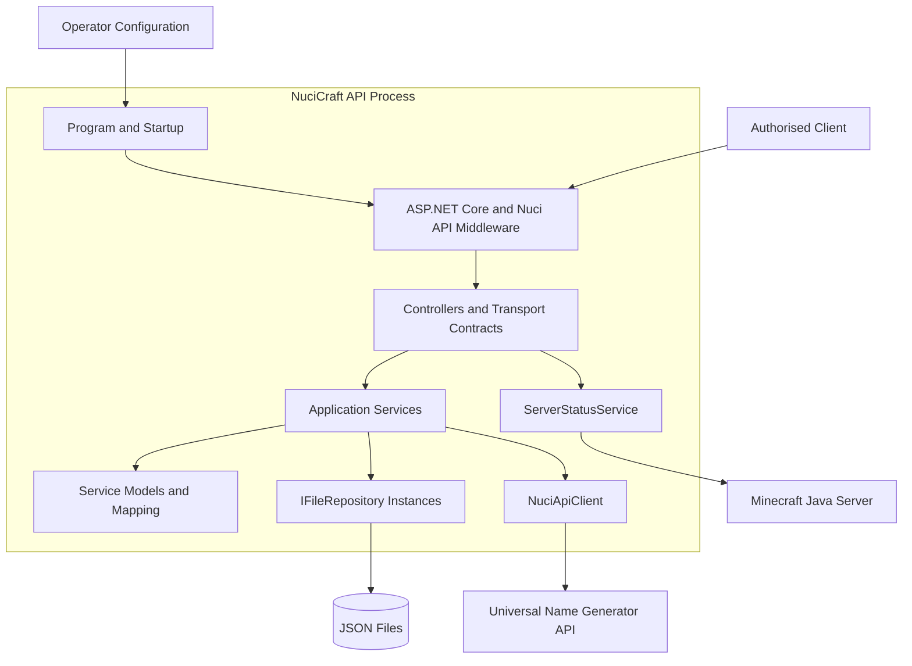
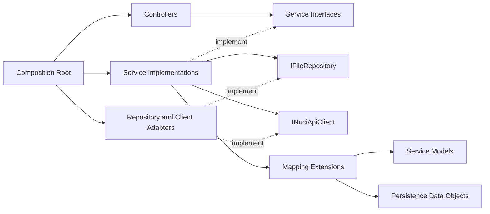
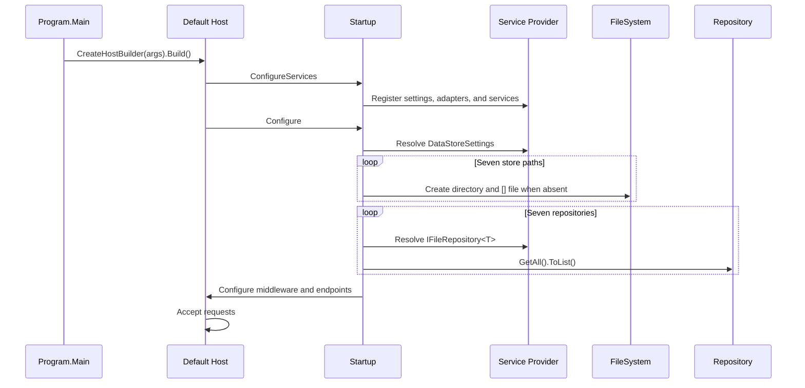
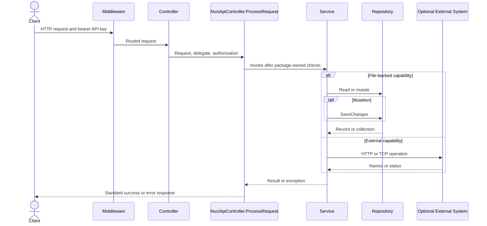

# Architecture

| Metadata | Value |
|----------|-------|
| Purpose | Describe the verified architectural decomposition, dependency direction, composition, runtime topology, and component collaboration. |
| Scope | The complete NuciCraft API process and its inbound, persistence, and outbound boundaries. Capability algorithms are linked rather than repeated in full. |
| Primary sources | [Program.cs](../NuciCraft.API/Program.cs), [Startup.cs](../NuciCraft.API/Startup.cs), [ServiceCollectionExtensions.cs](../NuciCraft.API/ServiceCollectionExtensions.cs), [Controllers](../NuciCraft.API/Controllers/), [Service](../NuciCraft.API/Service/), and [DataAccess](../NuciCraft.API/DataAccess/) |
| Related documents | [Repository overview](repository-overview.md), [repository structure](repository-structure.md), [design decisions](design-decisions.md), and [invariants](invariants.md) |

## Architectural Summary

NuciCraft API is a layered modular monolith hosted as one ASP.NET Core 10 process. It contains multiple capability modules but no independent deployment, database, queue, or worker boundary. The process exposes authenticated HTTP controllers, delegates decisions to application services, persists seven record types through NuciDAL file repositories, and invokes two external network systems.

## Projects And Process Boundaries

| Project | Purpose | Runtime Boundary |
|---------|---------|------------------|
| [NuciCraft.API](../NuciCraft.API/) | Web executable, controllers, services, models, mappings, persistence records, and configuration. | The sole production process. |
| [NuciCraft.API.UnitTests](../NuciCraft.API.UnitTests/) | Isolated tests for host composition, controllers, services, models, mappings, logging keys, and response construction. | Test process only. |
| [NuciCraft.API.IntegrationTests](../NuciCraft.API.IntegrationTests/) | In-memory HTTP host tests, restart-persistence tests, and loopback TCP server-status tests. | Test process and temporary filesystem only. |

The three projects are grouped by [NuciCraft.API.slnx](../NuciCraft.API.slnx). There is no production library package or second executable.

## Dependency Direction

Confirmed dependency rules are:
- Controllers depend on service interfaces, settings, request classes, and response classes. They do not resolve repositories.
- Services depend on repository interfaces, other service interfaces where cross-domain validation is required, settings, logging, and mapping extensions.
- Persistence records do not depend on controllers or services, except `PlayerSettingsDataObjectExtensions`, which consumes the patch DTO to preserve property-presence semantics.
- Service models do not invoke repositories or HTTP infrastructure.
- Concrete repository and HTTP client construction belongs to [ServiceCollectionExtensions.cs](../NuciCraft.API/ServiceCollectionExtensions.cs).
- [Startup.cs](../NuciCraft.API/Startup.cs) owns middleware order and initial store preparation.

The dependency direction is not enforced by separate class-library projects. It is an implementation convention within one project.

## Composition Root

### Program

[Program.cs](../NuciCraft.API/Program.cs) is the executable entry point. `Program.Main` calls `CreateHostBuilder(args).Build().Run()`. `CreateHostBuilder` uses `Host.CreateDefaultBuilder` and `UseStartup<Startup>`.

`Host.CreateDefaultBuilder` supplies framework configuration, logging, lifetime, and Kestrel defaults. The repository does not locally replace those providers.

### Service Registration

`Startup.ConfigureServices` performs four registrations in order:
1. ASP.NET Core controllers through `AddControllers`.
2. Six strongly typed setting objects and NuciLog settings through `AddConfigurations`.
3. Nuci API scanner-protection services.
4. Repositories, clients, application services, text utilities, and the logger through `AddCustomServices`.

The registrations in [ServiceCollectionExtensions.cs](../NuciCraft.API/ServiceCollectionExtensions.cs) are:

| Registration Group | Lifetime | Concrete Selection |
|--------------------|----------|--------------------|
| Six application settings objects | Singleton | Constructed, bound, and registered instances. |
| Seven `IFileRepository<T>` services | Singleton | One `JsonRepository<T>` per persisted record type. |
| `INuciApiClient` | Singleton | `NuciApiClient` constructed with the configured Universal Name Generator base URL. |
| Nine application services | Singleton | One implementation per service interface. |
| `INuciTextNormaliser`, `INuciTextObfuscator` | Singleton | NuciText implementations; no local production consumer is present. |
| `ILogger` | Scoped | `NuciLogger`. Singleton services therefore retain the instance resolved when the singleton is first constructed. |

`ServiceCollectionExtensions` retains `DataStoreSettings` in a private static field so repository factories can access paths. This creates process-global registration state and means multiple concurrent service-collection constructions are not isolated by design. Normal production startup invokes the registration once.

## Initialisation And Lifecycle

### Startup Sequence

Store preparation executes before middleware registration completes. `CreateStoreIfMissing` rejects null or whitespace paths, creates the path's parent directory when absent, and writes `[]` when the file is absent. Existing files are not rewritten or repaired. `EagerlyLoadRepositories` resolves and enumerates each repository, which makes missing registrations and unreadable persisted data startup failures.

No schema migration, seed procedure, retry, quarantine, or partial startup mode is implemented.

### Shutdown And Disposal

There is no local shutdown callback, hosted service, cancellation handler, repository flush, or logger flush. Shutdown and disposal use default ASP.NET Core host and dependency-injection semantics. Services invoke `SaveChanges` during each mutation, so correctness does not intentionally depend on a shutdown save.

## Middleware Pipeline

`Startup.Configure` orders middleware as follows:
1. Nuci API exception handling.
2. Nuci API scanner protection.
3. Nuci API request logging.
4. Developer exception page when `IWebHostEnvironment.IsDevelopment()` is true.
5. HTTPS redirection.
6. Default-file handling.
7. Static-file handling.
8. Routing.
9. ASP.NET Core authorisation.
10. Controller endpoint mapping.

The outer exception middleware is registered before request logging and the Development exception page. Exact package behaviour is external. The process calls `UseAuthorization` but does not locally register an authentication scheme, authorisation policy, `[Authorize]` attribute, or identity principal. Endpoint API-key checks are passed explicitly to `ProcessRequest` by every controller.

No files under a `wwwroot` directory are present, although default and static-file middleware are active.

## HTTP Boundary

Nine controllers in [Controllers](../NuciCraft.API/Controllers/) expose unversioned attribute routes. Their responsibilities are:
- Bind route, query, and body values.
- Construct request objects when no body object naturally exists.
- Copy route selectors into patch requests so the route controls record selection.
- Select the service method.
- Construct success content for read operations and Home mutations.
- Pass the configured API-key authorisation descriptor to `ProcessRequest`.

Controllers intentionally do not own persistence, domain validation, logging, or external-client construction. The server-information controller is the one exception to ordinary service delegation: it reads static fields directly from `ServerSettings` and calls `IServerStatusService` only for the live count.

Transport contracts reside in [Requests](../NuciCraft.API/Requests/) and [Responses](../NuciCraft.API/Responses/). Data annotations provide model validation, `JsonPropertyName` controls selected JSON names, and NuciSecurity `HmacOrder` attributes define canonical ordering metadata. HMAC computation and response envelopes are package-owned.

## Application Boundary

Service contracts in [Service](../NuciCraft.API/Service/) form the controller-facing interface. Their implementations own:
- Creation of identifiers and timestamps.
- Selector matching and filtering.
- Patch merge semantics.
- Domain-reference checks.
- Home name uniqueness and coordinate validation.
- RTP proximity calculations.
- Zone geometry canonicalisation and containment.
- Mob-to-generator-schema selection.
- Structured operation logging.
- Explicit repository save points.

Cross-domain dependencies are deliberately narrow:
- `HomeService` calls `IPlayerService.Get` to canonicalise and validate a player identifier.
- `ZoneService` uses world and zone-type repositories directly to validate references and enrich map links.
- Other file-backed services operate on one principal repository.

Services record failures and rethrow them. They do not translate exceptions into HTTP responses.

## Persistence Boundary

Persistence classes in [DataAccess/DataObjects](../NuciCraft.API/DataAccess/DataObjects/) extend the NuciDAL `EntityBase` through `NuciCraftEntityBase`, which adds `CreatedDT` and `UpdatedDT` string properties. `EntityBase` owns `Id`; its exact duplicate and serialisation semantics are external to this repository.

The seven repositories are independently configured and independently saved:
- `PlayerDataObject`
- `HomeDataObject`
- `RtpLocationEntity`
- `CountryDataObject`
- `WorldDataObject`
- `ZoneDataObject`
- `ZoneTypeDataObject`

No transaction coordinates multiple repositories. Cross-store references, such as Home to Player or Zone to World and ZoneType, are application checks rather than filesystem constraints.

Default store paths reside in ignored `Data/` runtime state. Relative paths resolve from the process working directory.

## Mapping Boundary

Mapping classes in [Service/Mapping](../NuciCraft.API/Service/Mapping/) convert persistence records to service models and back. [HomeMappingExtensions.cs](../NuciCraft.API/Service/Mappings/HomeMappingExtensions.cs) performs the identical role from the anomalously plural `Mappings` directory.

Important conversion responsibilities include:
- Parsing persisted timestamp strings into `DateTimeOffset` values.
- Formatting service timestamps through `TimestampFormats.Full` on writes.
- Converting string-backed `Gender`, `Localisation`, and `WorldType` values to enum-like model instances.
- Translating nested coordinates, zone bounds, localised strings, and player settings.

Mappings are internal implementation details. Controllers expose response-specific types rather than persistence records.

## External Integration Boundaries

### Universal Name Generator

`MobService` calls `INuciApiClient.SendRequestAsync` with an HTTP GET, `GenerateNamesRequest`, bearer-token authorisation, and the `Names` endpoint. It blocks synchronously with `GetAwaiter().GetResult()`. No timeout, retry, cache, circuit breaker, cancellation token, or fallback is configured locally.

### Minecraft Java Status

`ServerStatusService` creates one MineStat query per request using the configured hostname, Java port, five-second timeout, and legacy server-list protocol. It returns zero when construction raises `IOException` or `SocketException`, or when MineStat reports the server as unavailable. It propagates invalid configuration, non-numeric response parsing, and negative count failures.

### Web Map

The web map is not contacted. `ZoneService.EnrichZone` conditionally constructs a URL from `WebMapSettings.BaseUrl`, the teleportation point's world, X, and Z. The configured zone world selects the world record whose `HasWebMap` flag permits enrichment.

## Runtime Request Topology

## Failure Boundaries

| Boundary | Representative Failure | Local Conduct |
|----------|------------------------|---------------|
| Configuration | Empty store path, host, URL, or credential | Rejected only where the consuming code performs explicit validation. |
| Startup filesystem | Missing permission, invalid directory, malformed JSON | Propagates and prevents startup. |
| HTTP model binding | Missing required field or malformed JSON | Package and ASP.NET Core handling returns `400` in integration tests. |
| API key | Absent or invalid bearer value | `ProcessRequest` returns `401` in integration tests. |
| Domain validation | Duplicate Home name, invalid zone references or bounds, RTP proximity | Service raises `ArgumentException`; outer middleware translates it. |
| Missing record | Repository lookup or service search has no match | `KeyNotFoundException` reaches outer middleware and maps to `404` in tested paths. |
| Persistence | Repository read, mutation, or save fails | Service logs failure and rethrows; no retry or rollback. |
| Name generation | Unsuccessful or structurally invalid response | `MobService` raises `InvalidOperationException`; no fallback. |
| Minecraft status | Connection, socket, timeout, or unavailable server | Returns zero for the specifically handled conditions. |

## Architectural Constraints

- File repositories and singleton services are shared by concurrent requests in one process.
- Only Home operations have a local lock; other domain mutations have no application-level synchronisation.
- There is no cross-process coordination, so multiple writable API instances are not a documented consistency topology.
- Service methods are synchronous and do not accept cancellation tokens.
- Public HTTP routes are unversioned.
- Persisted schemas are unversioned and have no migration mechanism.
- Several critical semantics are supplied by external package versions rather than local source.
- Runtime data paths are relative unless deployment overrides them.
