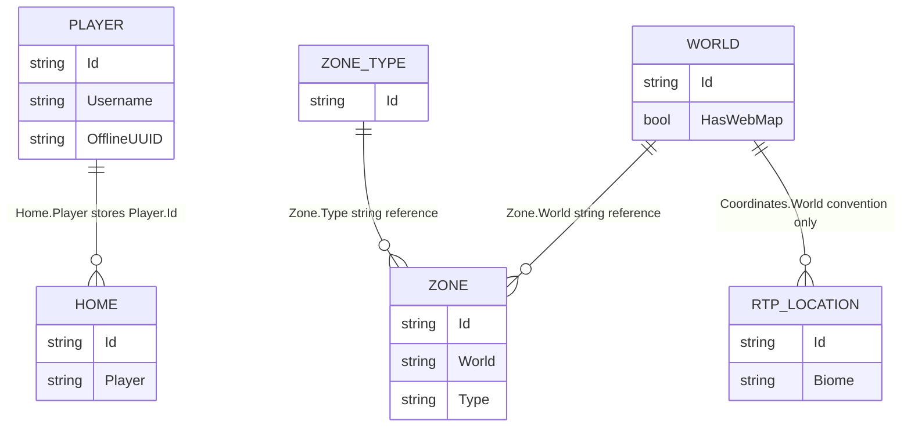

# Data Model

| Metadata | Value |
|----------|-------|
| Purpose | Catalogue domain, transport, persistence, configuration, and external-contract representations and explain their conversions and invariants. |
| Scope | All significant information structures in the runtime project. No database schema exists. |
| Primary sources | [Requests](../NuciCraft.API/Requests/), [Responses](../NuciCraft.API/Responses/), [Service/Models](../NuciCraft.API/Service/Models/), [DataAccess/DataObjects](../NuciCraft.API/DataAccess/DataObjects/), and [Configuration](../NuciCraft.API/Configuration/) |
| Related documents | [Persistence component](components/persistence-and-mapping.md), [interfaces](interfaces.md), [configuration](configuration.md), and [invariants](invariants.md) |

## Representation Layers

| Layer | Purpose | Lifetime |
|-------|---------|----------|
| Request DTO | Bind route, query, or body input; carry validation and HMAC metadata. | One inbound request. |
| Response content | Define successful public JSON content inside a Nuci API envelope. | One outbound response. |
| Service model | Represent typed application values and derived properties. | One operation unless retained by a caller. |
| Data object | Represent NuciDAL JSON records and nested persisted shapes. | Persistent through store files. |
| Configuration model | Hold process settings bound from configuration. | Process lifetime. |
| External request or response | Define the Universal Name Generator exchange. | One outbound name request. |

The layers intentionally overlap but are not interchangeable. Persistence timestamps are strings; Player and Home service timestamps are `DateTimeOffset`; patch types encode omission; responses can derive or omit fields.

## Common Persistence Base

[NuciCraftEntityBase.cs](../NuciCraft.API/DataAccess/DataObjects/NuciCraftEntityBase.cs) extends external NuciDAL `EntityBase`:

| Field | Type | Semantics |
|-------|------|-----------|
| `Id` | `string` from external base | Primary repository identifier. |
| `CreatedDT` | `string` | Application-generated creation timestamp. |
| `UpdatedDT` | `string` | Nullable application-generated revision timestamp. |

No local schema version, row version, deletion marker, or discriminator exists.

## Shared Nested Structures

### Coordinates

Both [Coordinates.cs](../NuciCraft.API/Service/Models/Coordinates.cs) and [CoordinatesDataObject.cs](../NuciCraft.API/DataAccess/DataObjects/CoordinatesDataObject.cs) contain:

| Field | Type | Default | Validation Context |
|-------|------|---------|--------------------|
| `World` | `string` | null | Home requires non-whitespace; Zone coordinate query requires non-whitespace; other uses vary. |
| `X` | `float` | 0 | Home requires finite; Zone and RTP services do not generally validate finite values. |
| `Y` | `float` | 0 | Identical variation. |
| `Z` | `float` | 0 | Identical variation. |
| `Pitch` | `float` | 0 | Home validates finite; Zone canonical bounds force zero. |
| `Yaw` | `float` | 179.9 | Home validates finite; Zone canonical bounds force zero. |

The data object assigns HMAC order 1 through 6. Mapping is one-to-one.

### Localised String

[LocalisedString.cs](../NuciCraft.API/Service/Models/LocalisedString.cs) and [LocalisedStringDataObject.cs](../NuciCraft.API/DataAccess/DataObjects/LocalisedStringDataObject.cs) contain eleven nullable strings:
- Default
- Chinese
- Dacian
- English
- French
- German
- Italian
- Japanese
- Latin
- Nucian
- Romanian

The data object explicitly serialises lower-case property names. Patch merges replace only non-null incoming values. Null cannot clear a persisted translation through current merge helpers.

### Zone Bounds

[ZoneBounds.cs](../NuciCraft.API/Service/Models/ZoneBounds.cs) and [ZoneBoundsDataObject.cs](../NuciCraft.API/DataAccess/DataObjects/ZoneBoundsDataObject.cs) contain FirstCorner and SecondCorner Coordinates. The data object assigns HMAC order 1 and 2.

Canonical semantics are min X, max Y, min Z for FirstCorner and max X, min Y, max Z for SecondCorner. Both corner worlds must match ordinally when validated.

## Player Representations

### Registration Request

[RegisterPlayerRequest.cs](../NuciCraft.API/Requests/RegisterPlayerRequest.cs) contains:

| Field Group | Fields | Notes |
|-------------|--------|-------|
| Identity | Username, DisplayName, OnlineUUID, Gender | Username is Required; offline UUID and identifier are generated. |
| Credential | Password | Persisted and returned as supplied. |
| Creation and network | CreatedDT, LastIpAddress, WikiUrl | CreatedDT is optional exact timestamp. |
| Ban | IsBanned, BannedDT, BannedReason, BannedBy | Bool defaults false. |
| Mute | IsMuted, MutedDT, MutedReason, MutedBy | Bool defaults false. |
| Activity | LastLoginDT, LastLogoutDT, LastLogoutLocation, LastSleptLocation, BedLocation, BackDT | Registration has no LastSleptDT, LastDeathDT, LastDeathLocation, or BackLocation. |

HMAC order preserves historical insertions: ban and mute reason/by fields use 19 through 22 while earlier chronology fields use 1 through 18.

### Player Patch Request

[PatchPlayerRequest.cs](../NuciCraft.API/Requests/PatchPlayerRequest.cs) contains four selector fields and mutable fields:

| Category | Fields |
|----------|--------|
| Selectors | Identifier (`id`), Username, OfflineUUID, OnlineUUID |
| Profile | DisplayName, Gender, Password, LastIpAddress, DiscordId, EmailAddress, WikiUrl |
| Moderation | IsBanned, BannedDT, BannedReason, BannedBy, IsMuted, MutedDT, MutedReason, MutedBy |
| Activity | LastLoginDT, LastLogoutDT, LastLogoutLocation, LastSleptDT, LastSleptLocation, BedLocation, LastDeathDT, LastDeathLocation, BackDT, BackLocation |
| Preferences | Settings |

Booleans for ban and mute are nullable so explicit false differs from omission. Reference-type null means preserve. Route assignment controls one selector.

### Player Settings

[PlayerSettings.cs](../NuciCraft.API/Service/Models/PlayerSettings.cs), [PlayerSettingsDataObject.cs](../NuciCraft.API/DataAccess/DataObjects/PlayerSettingsDataObject.cs), and [PatchPlayerSettingsRequest.cs](../NuciCraft.API/Requests/PatchPlayerSettingsRequest.cs) share:

| Field | Type | Default |
|-------|------|---------|
| AutomaticHotbarRefillingIsEnabled | bool | true |
| AutomaticSaplingReplantingIsEnabled | bool | true |
| AutomaticToolSelectionIsEnabled | bool | true |
| KeepExperienceIsEnabled | bool | false |
| KeepInventoryIsEnabled | bool | false |
| Localisation | model or string | Romanian in service model; null in fresh data object unless set |
| PrivateMessagesAreEnabled | bool | true |
| PrivateMessagesInterceptionIsEnabled | bool | false |
| SkinUrl | string | null |
| TeleportationRequestsAreEnabled | bool | true |

The patch DTO has private backing fields and internal `WasProvided` flags for all booleans. JSON deserialisation invokes a setter only when the property is present. Localisation and SkinUrl use ordinary null checks.

### Player Service Model And Data Object

[Player.cs](../NuciCraft.API/Service/Models/Player.cs) and [PlayerDataObject.cs](../NuciCraft.API/DataAccess/DataObjects/PlayerDataObject.cs) contain:

| Category | Fields | Representation Difference |
|----------|--------|---------------------------|
| Identity | Identifier/Id, Username, DisplayName, Gender, OfflineUUID, OnlineUUID | Gender model versus string. |
| Credential | Password | Identical string. |
| Persistence time | CreatedDT, UpdatedDT | Typed versus string. |
| Contact/profile | LastIpAddress, DiscordId, EmailAddress, WikiUrl | Identical strings. |
| Ban | IsBanned, BannedDT, BannedReason, BannedBy | Timestamp typed versus string. |
| Mute | IsMuted, MutedDT, MutedReason, MutedBy | Timestamp typed versus string. |
| Activity | Login, logout, sleep, bed, demise, and back timestamps or coordinates | Timestamp and nested representation differences. |
| Preferences | Settings | Service model versus data object. |

`Player.LastSeenDT` derives the maximum non-null value from CreatedDT, LastLoginDT, LastLogoutDT, LastSleptDT, LastDeathDT, and BackDT. CreatedDT ensures a value exists.

### Player Response

[GetPlayerResponse.cs](../NuciCraft.API/Responses/GetPlayerResponse.cs) projects every principal Player field except LastSeenDT. DisplayName falls back to Username. Password and personal fields are included. Gender and Settings both currently use HMAC order 27.

[GetPlayersResponse.cs](../NuciCraft.API/Responses/GetPlayersResponse.cs) contains `IEnumerable<GetPlayerResponse> Players` and derived ignored Count.

## Home Representations

### Requests

| Request | Fields | Notes |
|---------|--------|-------|
| [AddHomeRequest](../NuciCraft.API/Requests/AddHomeRequest.cs) | Name, Player, Location | All Required. Uses service models directly. |
| [PatchHomeRequest](../NuciCraft.API/Requests/PatchHomeRequest.cs) | Identifier, Name, Player, Location | Identifier is `JsonIgnore` and route-assigned; other fields optional. |
| [GetHomeRequest](../NuciCraft.API/Requests/GetHomeRequest.cs) | Identifier | Required and serialised as `id`. |
| [GetHomesRequest](../NuciCraft.API/Requests/GetHomesRequest.cs) | Player, Name | Optional query fields; controller branch determines required combination. |

### Model And Persistence

[Home.cs](../NuciCraft.API/Service/Models/Home.cs) contains Identifier, typed CreatedDT, nullable typed UpdatedDT, Name, Player, and Location. [HomeDataObject.cs](../NuciCraft.API/DataAccess/DataObjects/HomeDataObject.cs) stores Id, string timestamps, and nested data objects.

Player is a generated Player identifier. Home Name requires at least one value by service rule. Location is mandatory on addition.

### Responses

`GetHomeResponse` projects all six fields. `GetHomesResponse` contains `IEnumerable<Home>` defaulted to an empty collection and derived ignored Count.

## RTP Location Representations

| Representation | Fields |
|----------------|--------|
| [AddRtpLocationRequest](../NuciCraft.API/Requests/AddRtpLocationRequest.cs) | Required Biome, World, X, Y, Z. |
| [GetRtpLocationRequest](../NuciCraft.API/Requests/GetRtpLocationRequest.cs) | Optional Biome and World filters. |
| [RtpLocationEntity](../NuciCraft.API/DataAccess/DataObjects/RtpLocationEntity.cs) | Base Id/timestamps, Biome, nested Coordinates. |
| [RtpLocation](../NuciCraft.API/Service/Models/RtpLocation.cs) | Id, Biome, Coordinates. |
| [GetRtpLocationResponse](../NuciCraft.API/Responses/GetRtpLocationResponse.cs) | Id, Biome, Coordinates. |

The request separates World and coordinates; persistence nests World inside Coordinates. CreatedDT exists in persistence but is absent from service and response models.

## Country Representations

Country has Identifier/Id, Name, LeaderTitle, and Leader. Name and LeaderTitle are localised.

| Layer | Distinction |
|-------|-------------|
| Add request | Identifier Required; remaining fields optional. |
| Patch request | All fields optional; Identifier route-assigned. |
| Data object | Base string timestamps plus nested localised data objects. |
| Service model | No persistence timestamps. |
| Single response | Projects all service fields. |
| Collection response | `IEnumerable<Country>` and ignored derived Count. |

Sources are [CountryDataObject.cs](../NuciCraft.API/DataAccess/DataObjects/CountryDataObject.cs), [Country.cs](../NuciCraft.API/Service/Models/Country.cs), and Country contracts under [Requests](../NuciCraft.API/Requests/) and [Responses](../NuciCraft.API/Responses/).

## World Representations

World has Identifier/Id, Name, HasWebMap, optional SpawnPoint, and Type.

| Layer | Type Field | HasWebMap |
|-------|------------|-----------|
| Add request | Optional string | non-nullable bool, default false |
| Patch request | Optional string | nullable bool |
| Data object | string | bool |
| Service model | `WorldType` | bool |
| Response | `WorldType` | bool |

`WorldType` registry values are Overworld, Nether, and End with external lower-case names. Unsupported parse input returns Overworld.

## ZoneType Representations

ZoneType has Identifier/Id, `IEnumerable<string> Categories`, and localised Name. Add requires only Identifier. Patch Categories replaces the complete collection; Name merges. Collection responses add derived Count.

## Zone Representations

### Add And Patch Fields

[AddZoneRequest.cs](../NuciCraft.API/Requests/AddZoneRequest.cs) and [PatchZoneRequest.cs](../NuciCraft.API/Requests/PatchZoneRequest.cs) contain nineteen ordered fields:

| Order | Field | Add Semantics | Patch Semantics |
|-------|-------|---------------|-----------------|
| 1 | Identifier (`id`) | Required | Route-assigned |
| 2 | Name | Optional localised | Merge when supplied |
| 3 | Nickname | Optional localised | Merge when supplied |
| 4 | Type | Required ZoneType id | Validate and replace |
| 5 | County | Optional | Replace when non-null |
| 6 | Region | Optional | Replace when non-null |
| 7 | Country | Optional | Replace when non-null |
| 8 | World | Required World id | Validate and replace |
| 9 | CreationDate | Defaults from Romania date | Replace when non-null |
| 10 | Owners | Optional collection | Complete replacement |
| 11 | Creators | Optional or derived | Complete replacement |
| 12 | Leaders | Optional collection | Complete replacement |
| 13 | TeleportationPoint | Optional coordinates | Complete replacement |
| 14 | LeaderTitle | Optional localised | Merge when supplied |
| 15 | Population | int default zero | nullable int replacement |
| 16 | PopulationDate | Optional string | Replace when non-null |
| 17 | MapLink | Optional string | Replace when non-null |
| 18 | WikiUrl | Optional string | Replace when non-null |
| 19 | Bounds | Required | Optional partial-corner merge |

### Model And Persistence

[Zone.cs](../NuciCraft.API/Service/Models/Zone.cs) uses service LocalisedString, Coordinates, and ZoneBounds. [ZoneDataObject.cs](../NuciCraft.API/DataAccess/DataObjects/ZoneDataObject.cs) uses nested data objects and base persistence timestamps. Other scalar and collection fields correspond directly.

### Responses

`GetZoneResponse` projects all nineteen domain fields. `GetZonesResponse` contains Zone models and Count. `GetZoneIdentifiersResponse` contains identifier strings and Count for coordinate queries.

## Enum-Like Value Models

| Model | Values | Parse Fallback | External Form |
|-------|--------|----------------|---------------|
| [Gender](../NuciCraft.API/Service/Models/Gender.cs) | Male, Female, Other | Other | `male`, `female`, `other` |
| [Localisation](../NuciCraft.API/Service/Models/Localisation.cs) | Unsupported, English, Romanian | Unsupported | empty, `english`, `romanian` |
| [WorldType](../NuciCraft.API/Service/Models/WorldType.cs) | Overworld, Nether, End | Overworld | `overworld`, `nether`, `end` |
| [MobType](../NuciCraft.API/Service/Models/MobType.cs) | Unsupported plus nine supported mobs | Unsupported | lower-case or snake case |

All parse external names case-insensitively, implement value equality, return ExternalName from `ToString`, and expose registry values.

## External Name-Generation Models

[GenerateNamesRequest.cs](../NuciCraft.API/Service/GenerateNamesRequest.cs) contains Schema and Count with explicit lower-case JSON names, HMAC ordering, and Count range annotation. [GenerateNamesResponse.cs](../NuciCraft.API/Service/GenerateNamesResponse.cs) extends `NuciApiSuccessResponse` and contains top-level Names defaulted to an empty collection.

This top-level shape is significant: `MobService` casts the returned `NuciApiResponse` directly to `GenerateNamesResponse` rather than reading a nested content envelope.

## Server Models

`GetServerRequest` is empty. `GetServerResponse` contains Name, Hostname, JavaEditionPort, BedrockEditionPort, and OnlinePlayersCount with HMAC order 1 through 5. The first four values originate in settings; the final value originates in `IServerStatusService`.

## Configuration Models

| Model | Fields |
|-------|--------|
| `DataStoreSettings` | Seven store path strings. |
| `SecuritySettings` | ApiKey. |
| `ServerSettings` | Name, Hostname, JavaEditionPort, BedrockEditionPort. |
| `RtpLocationSettings` | MinimumLocationDistance, MinimumBiomeLocationDistance. |
| `UniversalNameGeneratorSettings` | BaseUrl, ApiKey. |
| `WebMapSettings` | BaseUrl. |

NuciLog settings are package-defined and bound separately.

## Relationships

Only Home owner, Zone World, and Zone Type references are application-validated. No storage-level foreign key, index, cascade, or transaction exists. RTP World is a naming convention and filter, not a validated World reference.

## Null, Optional, And Default Semantics

- Nullable patch references mean preserve, not clear.
- Nullable patch value types permit explicit false or zero.
- Player settings booleans use presence flags because their public patch properties are non-nullable.
- Localised merge null means preserve one language.
- Empty strings can replace many optional string fields because services test null rather than whitespace.
- Unknown enum-like strings use fallback values, except MobService rejects Unsupported after parsing.
- Missing persisted settings map to null on Player reads; registration creates defaults.
- Collection null and empty are distinct: null preserves during patch, empty replaces with an empty collection.

## Persistence Technology And Consistency

There are no tables, indexes, migrations, or database constraints. Each root record collection occupies one JSON file selected by configuration. NuciDAL owns serialisation and file-write mechanics. Services own read patterns, validation, and explicit save boundaries. Cross-store consistency is best-effort application sequencing without a transaction.
