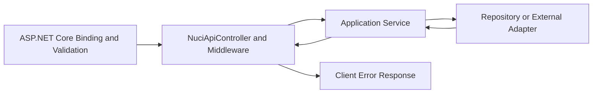

# Error Handling And Resilience

| Metadata | Value |
|----------|-------|
| Purpose | Document validation, domain, persistence, network, translation, logging, fallback, retry, cleanup, and partial-failure semantics. |
| Scope | Repository-local conduct plus observed package-boundary outcomes. |
| Primary sources | [Startup.cs](../NuciCraft.API/Startup.cs), concrete services under [Service](../NuciCraft.API/Service/), [ApiErrorResponseTests.cs](../NuciCraft.API.IntegrationTests/ApiErrorResponseTests.cs), and [ServerStatusServiceTests.cs](../NuciCraft.API.IntegrationTests/ServerStatusServiceTests.cs) |
| Related documents | [Architecture](architecture.md), [interfaces](interfaces.md), [state and persistence](state-and-persistence.md), and [invariants](invariants.md) |

## Error Ownership

The HTTP boundary delegates final response translation to Nuci API packages. Services generally identify domain failures, log, and rethrow. Startup failures occur outside the request pipeline and terminate initialisation.

## Error Taxonomy

| Category | Representative Sources | Local Exception Or Result |
|----------|------------------------|---------------------------|
| Model binding | Malformed JSON, missing Required field, count outside Range | ASP.NET Core and package result; tested `400`. |
| Authorisation | Missing or invalid API key | Package result; tested `401`. |
| Null or whitespace argument | Missing selector, world, type, category, path, setting | `ArgumentNullException` or `ArgumentException`. |
| Domain conflict | Duplicate Home name, RTP too close | `ArgumentException`. |
| Missing record | Repository direct Get or first-match search | `KeyNotFoundException`; tested direct World maps to `404`. |
| Unsupported capability | Unknown MobType or no schema | `NotImplementedException`; tested as `501`. |
| Invalid temporal data | Registration exact-format failure or persisted parse failure | `ArgumentException` or parse exception. |
| Persistence infrastructure | Path, permission, JSON, repository, save failure | Underlying exception, logged during requests. |
| External response | Generator error, type mismatch, vacant names | `InvalidOperationException`. |
| Network unavailability | Java I/O/socket/status unavailable | Zero fallback. |
| Invalid network data | Negative or non-numeric Java player count | `InvalidOperationException` or `FormatException`. |

## Validation Failures

### Transport Validation

Data annotations reject required transport values and invalid mob count before a controller delegate executes. Malformed JSON produces `application/problem+json` in integration tests.

Not every domain requirement has a data annotation. Home name content, Player patch selector count, Zone references and bounds, RTP proximity, and settings validity execute in services.

### Service Validation

Services use framework throw helpers and explicit conditions. Error messages are human-readable but are not a stable documented machine code. They can enter package error responses depending on external middleware conduct.

Important placement differences are:
- Player Register null check occurs before Started logging.
- Mob request and settings validation occurs before Started logging.
- Zone add reference and bounds validation occurs before Started logging and its `try` block.
- Home validation occurs inside its shared `Execute` try and lock.

Consequently, not every rejected operation creates a service Failure record.

## Domain Failures

### Player

- No matching selector: `KeyNotFoundException`.
- Patch selector count other than one: `ArgumentException`.
- Invalid registration timestamp: `ArgumentException` identifying the field.
- Invalid persisted or patched timestamp during later read: `DateTimeOffset` parse failure.

### Home

- Missing owner: propagated Player lookup failure.
- Vacant names or duplicate per-player name: `ArgumentException`.
- Invalid location or non-finite number: `ArgumentException`.
- Missing Home: repository exception.

### RTP

- General or same-biome threshold conflict: distinct `ArgumentException` messages.
- No selection candidate: `KeyNotFoundException`.

### Zone

- Invalid World or Type reference: `ArgumentException`, retaining missing-reference exception as inner exception.
- Missing bounds, corners, corner world, or exact world match: `ArgumentException`.
- Vacant category or coordinate World: `ArgumentException`.

## Persistence Failures

### Startup

No startup filesystem or repository exception is caught. The process fails before serving requests. Files or directories created before a later failure remain.

### Request Time

Services catch `Exception`, log Failure, and rethrow in most operations. They do not retry or restore an object modified before a repository failure. Exact file state after failed SaveChanges is an external NuciDAL concern.

There is no cross-store transaction. Home owner and Zone reference validation can succeed even when the subsequent target-store save fails.

## Network Failures

### Universal Name Generator

Every failure terminates the mob-name request. Remote unsuccessful responses are translated into local invalid-operation failures that include remote Code and Message. Transport and deserialisation exceptions propagate after logging. No retry or local generation fallback exists.

### Minecraft Java Status

The service treats expected unavailability as a successful degraded result:
- `IOException`: zero.
- `SocketException`: zero.
- MineStat reports unavailable: zero.

Invalid configuration and invalid parsed data remain failures. No error flag accompanies fallback zero.

## Timeout Handling

- Java status uses a compiled five-second MineStat timeout.
- Universal Name Generator has no local timeout setting; client defaults apply.
- Filesystem operations have no timeout.
- HTTP service methods accept no cancellation token.

## Retry And Fallback Matrix

| Operation | Retry | Fallback |
|-----------|-------|----------|
| Startup store creation or load | None | None; process fails. |
| Repository request operation | None | None. |
| Home duplicate conflict | None | None. |
| RTP conflict or vacant selection | None | None. |
| Mob-name generation | None | None. |
| Java status | None | Return zero for selected unavailability paths. |
| Zone map enrichment | None | No derived link when ineligible; missing referenced World still fails. |

## Error Translation

Confirmed through [ApiErrorResponseTests.cs](../NuciCraft.API.IntegrationTests/ApiErrorResponseTests.cs):
- Missing API key becomes `401 Unauthorized`.
- Invalid API key becomes `401 Unauthorized`.
- Missing required body field becomes `400 Bad Request`.
- Malformed JSON becomes `400 Bad Request` and `application/problem+json`.
- Missing World becomes `404 Not Found`.

Confirmed through mob integration tests: unsupported mob becomes `501 Not Implemented`.

The complete mapping of `ArgumentException`, `InvalidOperationException`, parse errors, and infrastructure exceptions is external to local source. Do not assert a status without a test or package inspection.

## Logging

Most services record:
1. Started with stable operation identity and selected context.
2. Success with optional count or selected coordinates.
3. Failure with exception and context.

`ServerStatusService` performs no direct service logging. Request middleware can still observe `/Server`.

Logs are diagnostics, not a transactional audit. A logging failure policy is package-owned.

## Cleanup And Resource Disposal

- Home monitor locks release through C# monitor semantics on return or exception.
- File and HTTP resource lifecycle is adapter-owned.
- MineStat lifecycle is library-owned; the local service does not expose disposal.
- Integration temporary directories are deleted by test-host disposal or explicit finally blocks.
- Production failures do not remove created store directories or files.

## Partial Failure

Potential partial states include:
- Data object modified in repository memory before SaveChanges failure.
- Empty store files created before another store fails startup.
- Remote generator may process a request even if the client later fails to receive its response.
- A Zone reference read can succeed before Zone persistence fails.
- Logs can record Started without a local terminal record when failure occurs outside a service try block or process terminates.

## Idempotency

| Operation | Idempotency Observation |
|-----------|-------------------------|
| GET | Intended read-only, except possible package-internal materialisation and Zone object canonicalisation without save. |
| POST | Non-idempotent; generated identifiers or duplicate add semantics apply. |
| PATCH | Reapplying values still changes UpdatedDT and saves. |
| DELETE | Repetition depends on repository absent-record conduct. |
| Server status | Read-only but live external result varies. |
| Mob name | Read-only locally but returns non-deterministic external results. |

## Modification Guidance

- Add tests for every novel exception-to-status expectation.
- Keep validation before mutation when failure must leave state intact.
- Define retry idempotency before adding retries to writes.
- Preserve remote fallback distinctions deliberately.
- Never log secrets or full personal records as new context.
- Add cancellation end to end rather than only at one adapter call.
