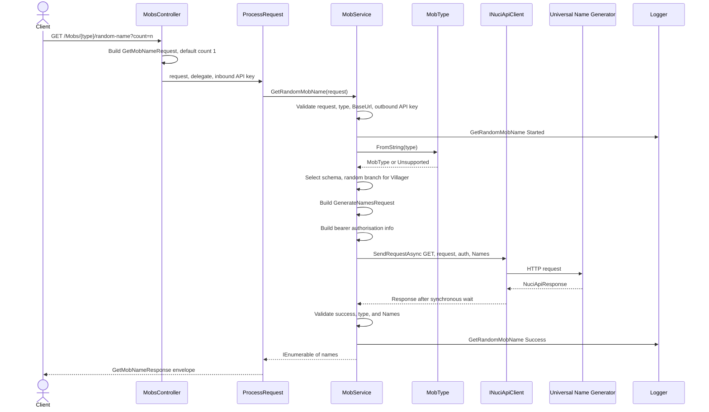
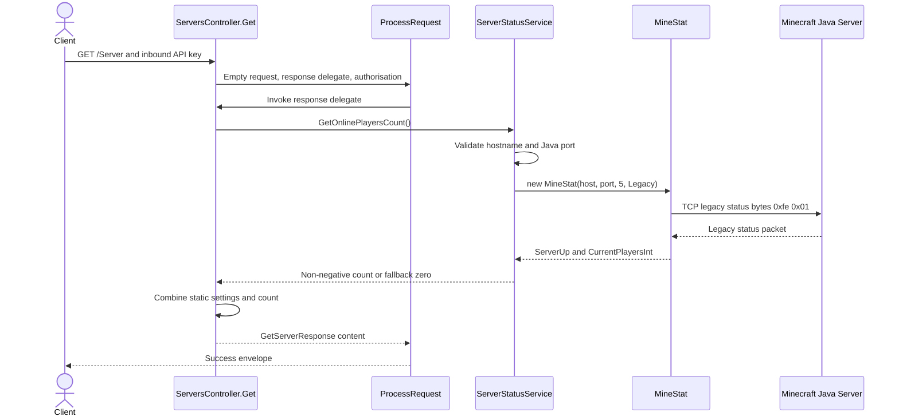
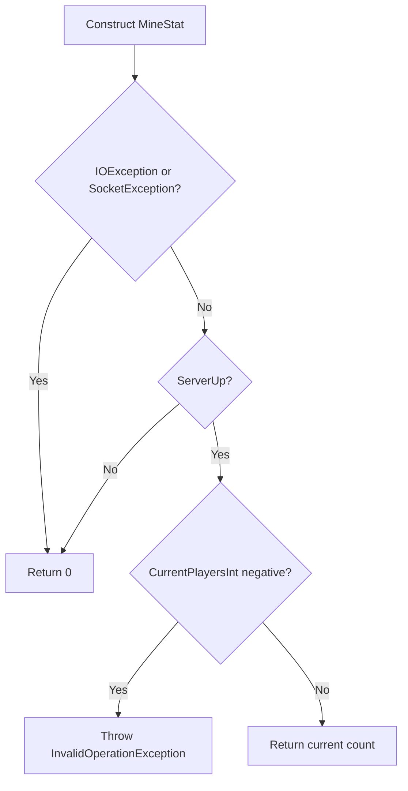

# External Request Flows

| Metadata | Value |
|----------|-------|
| Purpose | Trace Universal Name Generator HTTP calls and Minecraft Java legacy status calls from inbound route to final response. |
| Scope | Mob-name and Server-information request paths, including authentication, schemas, protocol, fallbacks, and failures. |
| Primary sources | [MobsController.cs](../../NuciCraft.API/Controllers/MobsController.cs), [MobService.cs](../../NuciCraft.API/Service/MobService.cs), [ServersController.cs](../../NuciCraft.API/Controllers/ServersController.cs), and [ServerStatusService.cs](../../NuciCraft.API/Service/ServerStatusService.cs) |
| Related documents | [External-service component](../components/external-services.md), [external behaviour](../behaviour/rtp-and-external-capabilities.md), and [architecture](../architecture.md) |

## Universal Name Generator Flow

### Initiator And Initial State

An authorised client requests one or more names for a route mob type. The singleton NuciApiClient has already been constructed with configured BaseUrl. No local result cache exists.

### Ordered Trace

### Branches

- Omitted count retains `GetMobNameRequest.Count == 1`.
- Unsupported type fails before outbound traffic.
- Villager randomly selects one of two schemas.
- An unsuccessful response preserves remote Code and Message in the local exception.
- Successful response of an unexpected runtime type still fails.
- Any null, vacant, or whitespace generated element rejects the complete response.

### Authentication Boundaries

The inbound bearer API key authorises the client versus NuciCraft API. A separate configured bearer token is passed in `NuciApiRequestAuthorisationInfo` to the Universal Name Generator. The inbound token is not forwarded.

### Final State

On success, names leave only in the HTTP response and operation log context contains type and count, not names. No persistence or emitted event occurs. On failure, the service logs and rethrows; no retry or cleanup action is present.

## Minecraft Java Status Flow

### Initiator And Initial State

An authorised client invokes `GET /Server`. `ServerSettings` is a process singleton. No prior count or open socket is retained.

### Ordered Trace

### Fallback Branches

MineStat parsing can raise exceptions outside the two caught types. Integration tests demonstrate non-numeric player count produces `FormatException`.

### Protocol Evidence

[ServerStatusServiceTests.cs](../../NuciCraft.API.IntegrationTests/ServerStatusServiceTests.cs) hosts a loopback `TcpListener` and confirms the query begins with the legacy bytes `0xfe 0x01`. It sends a big-endian Unicode status payload and verifies multiple non-negative counts, live re-query, unavailable response zero, timeout zero, negative failure, and non-numeric failure.

### Final State

No connection or count is retained by local source. Static settings plus the result become one response. Zero can represent either actual zero players or degraded status. No retry, Bedrock query, cache, metric, or background refresh follows.

## Shared Concurrency And Cancellation

Both paths use synchronous service contracts. MobService blocks on an asynchronous HTTP operation, and MineStat performs synchronous network work. Neither accepts request cancellation. Concurrent requests share settings and the outbound HTTP client but otherwise construct independent operation state.
