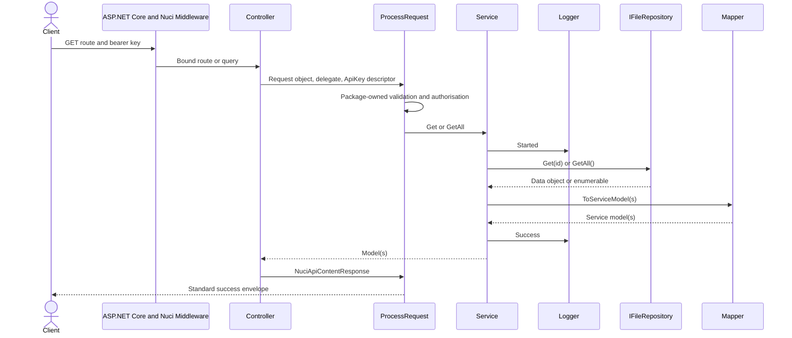
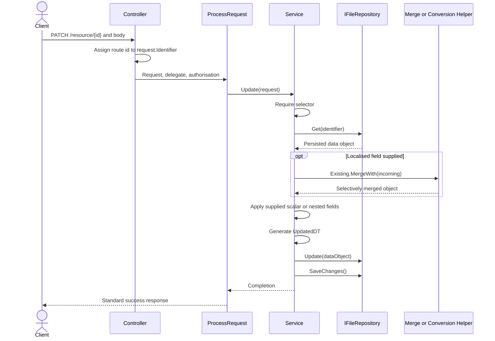
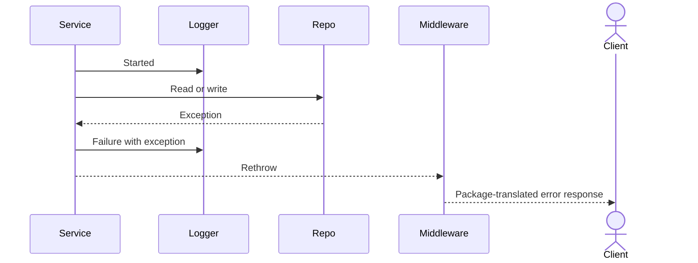

# File-Backed Request Flow

| Metadata | Value |
|----------|-------|
| Purpose | Trace the shared controller-to-service-to-JSON execution model used by ordinary domain requests. |
| Scope | Country, World, ZoneType, and representative direct repository requests; specialised Player, Home, Zone, and RTP branches are documented separately. |
| Primary sources | [Controllers](../../NuciCraft.API/Controllers/), [Service](../../NuciCraft.API/Service/), [DataAccess](../../NuciCraft.API/DataAccess/), and [Startup.cs](../../NuciCraft.API/Startup.cs) |
| Related documents | [HTTP boundary](../components/http-api-boundary.md), [persistence](../components/persistence-and-mapping.md), [architecture](../architecture.md), and [geographic behaviour](../behaviour/geographic-metadata-capabilities.md) |

## Initiator And Entry Point

An external client initiates an HTTP request with a bearer API key. The exact entry point is an attribute-routed controller action.

## Initial State

- The process has prepared all stores.
- Controller dependencies have been resolved.
- The service and repository are singleton instances.
- Persisted records may or may not contain the requested identifier.

## Generic Read Sequence

Country, World, and ZoneType direct reads follow this sequence. A collection response also computes Count from its enumerable.

## Generic Addition Sequence

1. ASP.NET Core binds a JSON body and executes data-annotation validation.
2. Controller passes the body object and a service delegate to `ProcessRequest`.
3. Package-owned processing validates the service-wide API key.
4. Service validates request presence and constructs log context.
5. Service logs Started.
6. Service constructs a data object from request values.
7. Service generates CreatedDT.
8. Domain-specific canonicalisation occurs, such as WorldType fallback.
9. Repository `Add` is invoked.
10. Repository `SaveChanges` is invoked.
11. Service logs Success.
12. `ProcessRequest` emits the base success response.

The command returns no created representation for Country, World, or ZoneType.

## Generic Patch Sequence

Null patch references preserve values. Country and World localised properties merge. ZoneType Categories replaces the complete collection. World nullable HasWebMap applies explicit false.

## Data At Each Phase

| Phase | Representation |
|-------|----------------|
| HTTP binding | Request DTO with transport attributes. |
| Service input | Identical request instance, with route identifier assigned for patches. |
| Persistence mutation | Domain-specific data object with string persistence timestamps. |
| Repository storage | JSON representation controlled by NuciDAL and object attributes. |
| Retrieval | Data object or enumerable. |
| Mapping | Service model with typed nested or enum-like values. |
| HTTP output | Response content wrapped by Nuci API. |

## Decision Points

- Authorisation acceptance is package-owned.
- Missing Required values fail before the delegate.
- Missing direct record fails in repository or service search.
- Null patch fields preserve values.
- Unknown World Type canonicalises to Overworld rather than failing.
- Null or whitespace collection filters generally mean no filter.

## Persistence And Side Effects

Each successful command saves exactly one repository. There is no transaction, emitted event, cache invalidation, or background follow-up. Logging records started and terminal operation states.

## Error Path

Model-binding and authorisation failures can occur before service invocation and therefore have no service operation log. Repository failures after an in-memory record is modified have no local rollback.

## Final State

- Read success leaves intended persisted state unchanged.
- Addition success persists one novel record.
- Patch success persists one revised record and novel UpdatedDT.
- Failure state depends on the point of failure and NuciDAL atomicity, which local source does not define.
