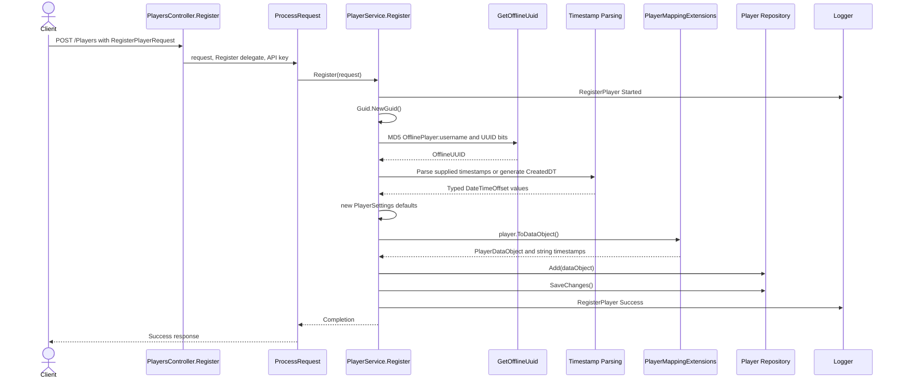
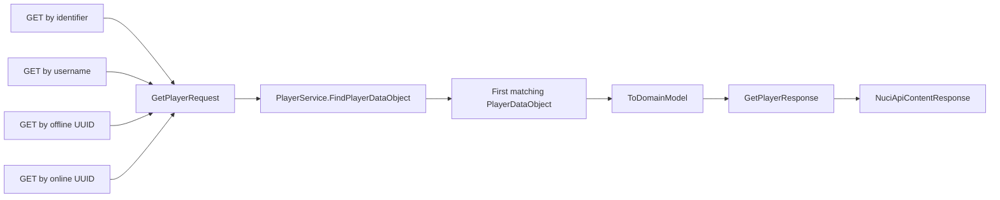
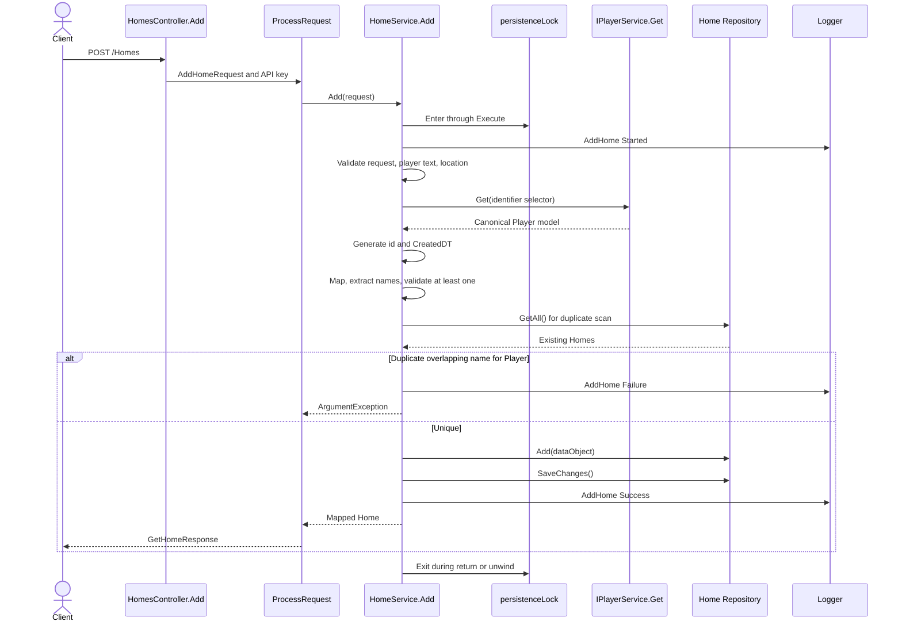
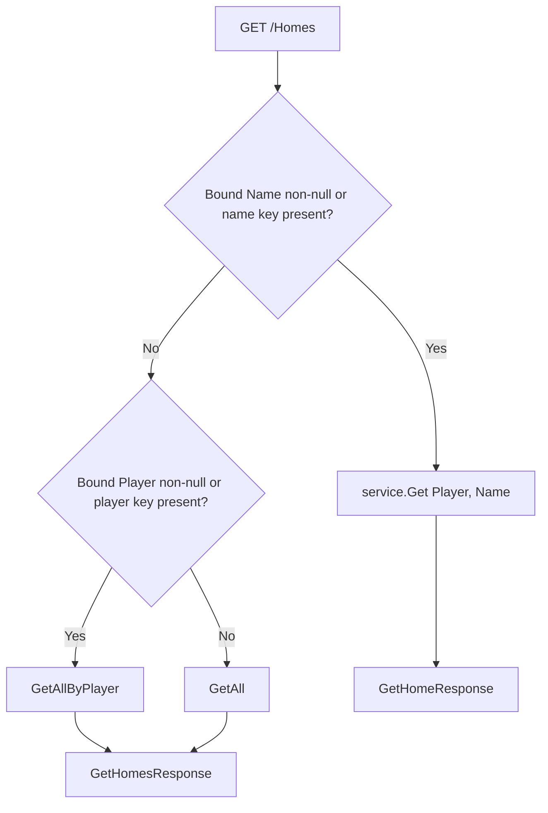

# Player And Home Request Flows

| Metadata | Value |
|----------|-------|
| Purpose | Preserve method-level Player and Home call graphs, transformations, lock boundaries, and state changes. |
| Scope | Player registration and patch, Home addition and patch, plus selector reads. |
| Primary sources | [PlayerService.cs](../../NuciCraft.API/Service/PlayerService.cs), [HomeService.cs](../../NuciCraft.API/Service/HomeService.cs), [PlayersController.cs](../../NuciCraft.API/Controllers/PlayersController.cs), and [HomesController.cs](../../NuciCraft.API/Controllers/HomesController.cs) |
| Related documents | [Player and Home behaviour](../behaviour/player-and-home-capabilities.md), [Player and Home components](../components/player-and-homes.md), and [invariants](../invariants.md) |

## Player Registration Trace

Failure after Started enters the service catch, records Failure, and rethrows. Request-null rejection occurs before log context construction; HTTP binding does not pass null for a valid body.

## Player Patch Trace

1. One of four controller actions receives a route selector and body.
2. Controller writes route selector into `PatchPlayerRequest`.
3. `ProcessPatchRequest` passes the request to `ProcessRequest`.
4. `PlayerService.Update` logs selector context.
5. `ValidatePatchSelectors` counts non-whitespace selector values and requires one.
6. `FindPlayerDataObject` calls repository `GetAll`, OR-matches selectors, and takes first match.
7. `ApplyPatchValues` examines every mutable field in source order.
8. A non-null Settings object invokes `PlayerSettingsDataObject.MergeWith`.
9. Boolean setting setters have previously marked which JSON properties were present.
10. Service generates string UpdatedDT.
11. Repository Update and SaveChanges execute.
12. Service records Success; controller returns no content record.

If a patch stores an invalid timestamp string, this operation can succeed. A later Player mapping parses that value and can fail.

## Player Retrieval Trace

The four selector controllers converge on `ProcessGetRequest`:

`ToDomainModel` parses all timestamps, maps coordinates, converts Gender and Settings, and exposes Password. `GetPlayerResponse` applies only DisplayName fallback.

## Home Addition Trace

Because Player lookup occurs inside the lock, a slow or failing Player repository operation blocks every concurrent Home operation in this process.

## Home Patch Trace

1. Controller sets `PatchHomeRequest.Identifier` from route; JSON cannot set it due to `JsonIgnore`.
2. `HomeService.Update` enters `Execute`, acquires the lock, and logs Started.
3. Validate request and identifier.
4. Repository `Get(identifier)` returns a data object.
5. Map to Home service model and back to a data object.
6. Merge a supplied Name language by language.
7. Resolve a supplied Player through `IPlayerService.Get` and store canonical identifier.
8. Validate and replace a supplied Location.
9. Extract all resulting names and scan repository records, excluding the identical Home id.
10. Reject a destination-player conflict before repository update.
11. Generate UpdatedDT.
12. Update and save.
13. Map result, log Success, release lock, and return content.

The map-out and map-back step creates a detached candidate under ordinary object semantics. It preserves Identifier and creation metadata before patching.

## Home Query Branch Trace

`HomesController.GetAll` branches on both bound values and raw query-key presence:

An empty `name` key selects the single-Home path and then fails service whitespace validation rather than falling through to a collection.

## State And Side Effects

- Registration adds and saves one Player record.
- Player patch updates and saves one Player record.
- Home addition or patch scans and then saves under one lock.
- Home deletion removes and saves under the identical lock.
- Retrieval logs but performs no explicit save.
- No emitted events, external calls, or cross-store transactions exist.

## Final Conditions

Successful Home writes preserve per-player name uniqueness relative to every operation passing through the identical singleton instance. This guarantee does not extend to another process, direct repository use, or external file modifications.
