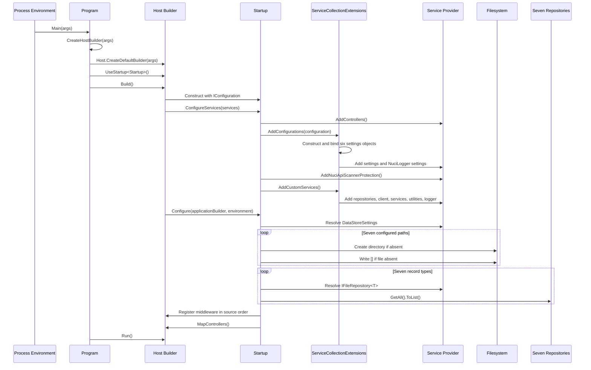

# Process Startup Flow

| Metadata | Value |
|----------|-------|
| Purpose | Preserve the exact host, dependency-registration, store-preparation, and middleware initialisation sequence. |
| Scope | Process entry through readiness to accept controller requests. |
| Primary sources | [Program.cs](../../NuciCraft.API/Program.cs), [Startup.cs](../../NuciCraft.API/Startup.cs), and [ServiceCollectionExtensions.cs](../../NuciCraft.API/ServiceCollectionExtensions.cs) |
| Related documents | [Host component](../components/host-and-composition.md), [architecture](../architecture.md), and [repository structure](../repository-structure.md) |

## Initiator And Entry Point

The operating environment initiates the compiled executable. The exact managed entry point is `Program.Main(string[] args)`.

## Initial State

Before local application initialisation:
- Process arguments and environment variables are available to the default host.
- Configuration files must be discoverable through the content root.
- Store files may exist, be absent, or be invalid.
- The dependency-injection container has not been constructed.
- No controller endpoint is accepting requests.

## Ordered Trace

### Phase 1: Default Host

`CreateHostBuilder` calls `Host.CreateDefaultBuilder(args)`. Standard ASP.NET Core configuration and lifetime conduct enters here. Local source then calls `ConfigureWebHostDefaults` and selects `Startup`.

### Phase 2: Settings Binding

`AddConfigurations` constructs each settings object manually, calls `IConfiguration.Bind` with the local variable name, and registers the instance as a singleton. The sequence is:
1. Data stores.
2. Security.
3. Server metadata.
4. RTP thresholds.
5. Web map.
6. Universal Name Generator.
7. NuciLog package settings registration.

No validation executes at binding time.

### Phase 3: Runtime Dependency Selection

`AddCustomServices` registers:
1. Seven singleton JSON repositories using path delegates.
2. Singleton `NuciApiClient` using generator BaseUrl.
3. Nine singleton application service implementations.
4. Two singleton NuciText utilities.
5. Scoped `NuciLogger` as `ILogger`.

Repository path delegates close over the static `dataStoreSettings` field assigned in Phase 2.

### Phase 4: Store Creation

`Startup.Configure` calls `PrepareRepositories` before middleware registration. For each path, `CreateStoreIfMissing`:
1. Calls `ArgumentException.ThrowIfNullOrWhiteSpace`.
2. Calls `Path.GetDirectoryName`.
3. Creates the directory when `Directory.Exists` is false.
4. Writes the exact text `[]` when the store file is absent.

An existing file remains intact regardless of content.

### Phase 5: Eager Repository Enumeration

`EagerlyLoadRepositories` invokes the generic helper for Player, RTP Location, Country, Home, World, Zone, and ZoneType in that order. Each helper resolves `IFileRepository<T>` and forces enumeration with `GetAll().ToList()`.

The return values are discarded. The phase verifies resolution and materialisation and may initialise package-internal repository state.

### Phase 6: Middleware

Middleware is registered in this exact order:
1. Nuci API exception handling.
2. Nuci API scanner protection.
3. Nuci API request logging.
4. Developer exception page only in Development.
5. HTTPS redirection.
6. Default files.
7. Static files.
8. Routing.
9. Authorisation.
10. Controller endpoints.

## Branches

| Condition | Branch |
|-----------|--------|
| Store directory absent | Create it. |
| Store file absent | Create it with an empty JSON array. |
| Store file present | Preserve and enumerate it. |
| Development environment | Register Developer Exception Page. |
| Any other environment | Omit Developer Exception Page. |

## Failure Paths

The sequence terminates without process readiness when:
- A path is null or whitespace.
- Parent-directory derivation or creation fails.
- File creation fails.
- Repository resolution fails.
- Existing JSON cannot materialise.
- Service construction fails during eager resolution.
- Middleware registration or host construction fails.

No local catch, retry, fallback, rollback, or partial endpoint activation exists. Directories or empty files created before a later failure remain as filesystem side effects.

## Final State

On success:
- Six application settings singletons are bound.
- Every runtime dependency is registered.
- Seven store paths exist and each repository has successfully enumerated.
- Middleware and controller endpoints are configured.
- The host can accept requests.

## Shutdown

Process shutdown uses framework defaults. There is no local callback, cancellation orchestration, final repository save, or explicit logger flush.
