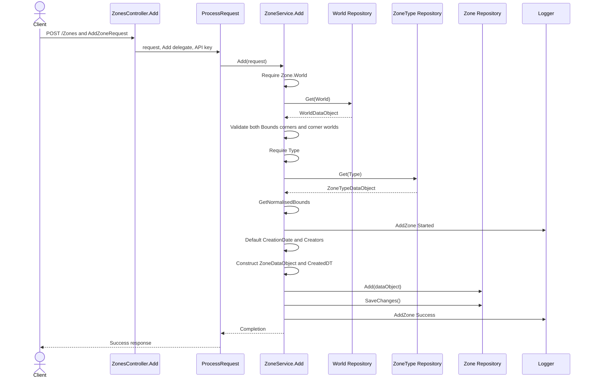
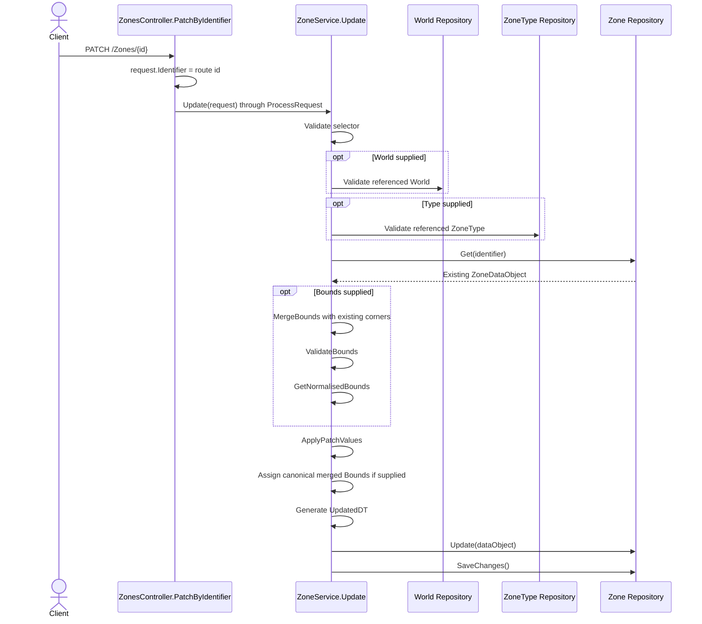
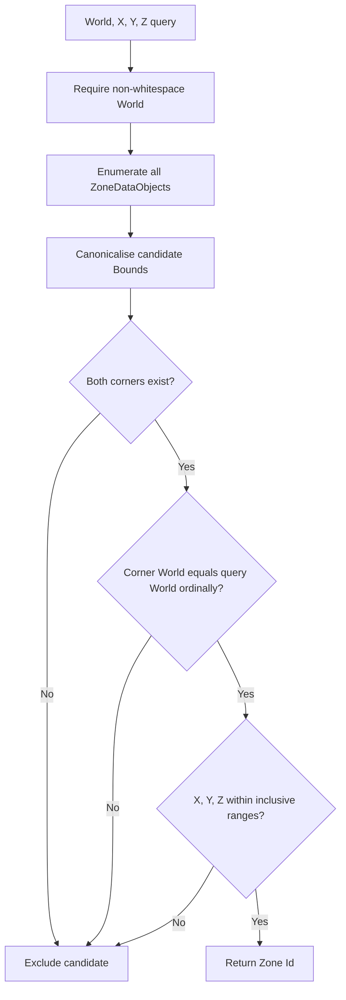

# Zone Request Flows

| Metadata | Value |
|----------|-------|
| Purpose | Preserve method-level Zone creation, patching, retrieval, filtering, enrichment, and containment execution. |
| Scope | `ZonesController` through `ZoneService` and the Zone, World, and ZoneType repositories. |
| Primary sources | [ZonesController.cs](../../NuciCraft.API/Controllers/ZonesController.cs), [ZoneService.cs](../../NuciCraft.API/Service/ZoneService.cs), and Zone request, model, and data-object types |
| Related documents | [Geographic behaviour](../behaviour/geographic-metadata-capabilities.md), [geographic components](../components/geographic-metadata.md), and [invariants](../invariants.md) |

## Zone Creation Trace

### Validation Failure Branches

- Vacant or missing World: argument failure.
- Absent World repository record: caught `KeyNotFoundException`, wrapped as `ArgumentException`.
- Null Bounds: argument failure.
- Missing corner or corner World: argument failure.
- Different corner Worlds: argument failure containing both values.
- Vacant or missing Type: argument failure.
- Absent ZoneType: wrapped argument failure.

These branches execute before Started logging. A repository exception other than `KeyNotFoundException` during reference validation also occurs before the operation `try` block.

### Canonicalisation

`GetNormalisedBounds` creates new corner objects. It does not mutate the request corner instances. FirstCorner receives min X, max Y, min Z; SecondCorner receives max X, min Y, max Z. Both orientations become zero.

### Default Branches

- Supplied non-whitespace CreationDate is preserved verbatim.
- Otherwise current Romania date plus ` (?)` is stored.
- Supplied Creators wins.
- Otherwise exactly one Owner is copied to Creators.
- Otherwise Creators remains null.

## Zone Patch Trace

Reference validation precedes retrieval of the target Zone. A patch for an absent Zone can therefore first fail on an invalid supplied World or Type.

`ApplyPatchValues` handles every field except Bounds. Localised values merge; collection and nested coordinate values replace; nullable Population applies explicit zero.

## Direct Zone Read And Enrichment

1. Controller constructs `GetZoneRequest` from route.
2. Service logs Started.
3. Zone repository direct Get returns record.
4. Service canonicalises and assigns Bounds on the returned data object.
5. Zone mapping produces service model.
6. `EnrichZone` checks existing MapLink, TeleportationPoint, and Zone.World.
7. When eligible, World repository direct Get resolves Zone.World.
8. `HasWebMap == true` constructs a derived URL from configured BaseUrl and teleportation World, X, Z.
9. Service logs Success and response projects all Zone fields.

An absent referenced World can therefore make a Zone read fail only when enrichment reaches the lookup. An explicit MapLink bypasses that lookup.

## Type And Category Collection Traces

### Type

`GetAllZones(type)` performs:
1. Zone repository `GetAll`.
2. Include all for vacant Type, otherwise case-insensitive equality.
3. Canonicalise each data object's Bounds.
4. Map all records.
5. Enrich each Zone, potentially reading World repository once per eligible Zone.
6. Count for logging and later count for response projection.

### Category

`GetZonesByCategory(category)` performs:
1. Reject vacant category.
2. ZoneType repository `GetAll`.
3. Ignore null category collections.
4. Exact case-sensitive category membership filter.
5. Materialise matching ZoneType identifiers as an array.
6. Zone repository `GetAll`.
7. Exact case-sensitive Type membership against the identifier array.
8. Canonicalise, map, enrich, and return.

No direct relational join or index exists.

## Coordinate Containment Trace

Containment uses Bounds World, not Zone.World. The result contains identifiers and count only.

## Deletion Trace

`ZonesController.Delete` constructs `GetZoneRequest` for transport processing. The service itself logs, calls `repository.Remove(zoneIdentifier)`, calls `SaveChanges`, and logs Success. It neither reads the record first nor checks references.

## Persistence And Final State

- Addition and patch modify only the Zone repository after read-only reference checks.
- Deletion modifies only the Zone repository.
- Read enrichment is not saved.
- Bounds canonicalisation during reads is assigned to the repository-returned data object but not explicitly saved.
- No event, cascade, transaction, or cache invalidation follows any operation.
