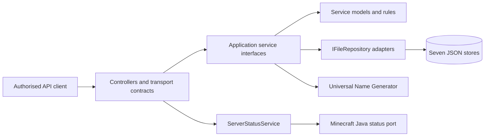

# Repository Overview

| Metadata | Value |
|----------|-------|
| Purpose | Explain what NuciCraft API accomplishes, its principal capabilities, system boundary, and conceptual lifecycle. |
| Scope | Repository-level concepts and confirmed runtime conduct. Detailed contracts and algorithms are outside this document. |
| Primary sources | [Program.cs](../NuciCraft.API/Program.cs), [Startup.cs](../NuciCraft.API/Startup.cs), [ServiceCollectionExtensions.cs](../NuciCraft.API/ServiceCollectionExtensions.cs), [Controllers](../NuciCraft.API/Controllers/), [Service](../NuciCraft.API/Service/), and [DataAccess](../NuciCraft.API/DataAccess/) |
| Related documents | [Documentation index](README.md), [architecture](architecture.md), [repository structure](repository-structure.md), and [security](security.md) |

## Repository Purpose

NuciCraft API is an authenticated ASP.NET Core HTTP service that centralises operational data and utility functions for the NuciCraft Minecraft environment. It provides one network-accessible process for clients that require:
- Minecraft server identity and a live Java-edition online-player count.
- Player registration, retrieval, and mutable profile or gameplay state.
- Player-owned homes with localised names and coordinates.
- Random-teleport location collection and random selection under spatial separation rules.
- World, country, zone-type, and zone metadata management.
- Zone classification and three-dimensional coordinate containment queries.
- Mob-name generation delegated to the Universal Name Generator API.

The process is not a Minecraft plug-in and does not modify a running Minecraft server. The sole direct Minecraft interaction is a read-only Java legacy server-list status query implemented by `ServerStatusService` in [ServerStatusService.cs](../NuciCraft.API/Service/ServerStatusService.cs). All other capabilities operate on API-owned state or invoke the Universal Name Generator.

## Intended Consumers

Confirmed consumers and operators are:
- API clients possessing the configured service-wide API key. The repository does not define separate users, roles, scopes, or per-player authorisation.
- NuciCraft server-side integrations that require player, home, teleportation, world, or geopolitical metadata.
- Deployment operators who provide configuration, protected credentials, writable storage, outbound connectivity, and process supervision.
- Contributors modifying the HTTP contracts, application services, persistence records, mappings, integrations, or tests.

No browser user interface, command-line client, software development kit, message consumer, or plug-in host is implemented in this repository.

## Principal Capabilities

| Capability | HTTP Owner | Application Owner | State or External Effect |
|------------|------------|-------------------|--------------------------|
| Server information | [ServersController](../NuciCraft.API/Controllers/ServersController.cs) | [ServerStatusService](../NuciCraft.API/Service/ServerStatusService.cs) | Reads bound server metadata and performs a live TCP status query. |
| Player management | [PlayersController](../NuciCraft.API/Controllers/PlayersController.cs) | [PlayerService](../NuciCraft.API/Service/PlayerService.cs) | Reads and mutates the configured player JSON store. |
| Home management | [HomesController](../NuciCraft.API/Controllers/HomesController.cs) | [HomeService](../NuciCraft.API/Service/HomeService.cs) | Reads and mutates the home store after player and uniqueness validation. |
| Random teleportation | [RtpLocationsController](../NuciCraft.API/Controllers/RtpLocationsController.cs) | [RtpLocationService](../NuciCraft.API/Service/RtpLocationService.cs) | Persists spatially separated locations and selects a random filtered record. |
| Country metadata | [CountriesController](../NuciCraft.API/Controllers/CountriesController.cs) | [CountryService](../NuciCraft.API/Service/CountryService.cs) | Reads and mutates localised country records. |
| World metadata | [WorldsController](../NuciCraft.API/Controllers/WorldsController.cs) | [WorldService](../NuciCraft.API/Service/WorldService.cs) | Reads and mutates world records and canonicalises world types. |
| Zone-type metadata | [ZoneTypesController](../NuciCraft.API/Controllers/ZoneTypesController.cs) | [ZoneTypeService](../NuciCraft.API/Service/ZoneTypeService.cs) | Reads, filters, and mutates zone classifications. |
| Zone metadata and geometry | [ZonesController](../NuciCraft.API/Controllers/ZonesController.cs) | [ZoneService](../NuciCraft.API/Service/ZoneService.cs) | Validates references, canonicalises bounds, enriches map links, and mutates zone records. |
| Mob-name generation | [MobsController](../NuciCraft.API/Controllers/MobsController.cs) | [MobService](../NuciCraft.API/Service/MobService.cs) | Sends a bearer-authenticated HTTP request to the Universal Name Generator API. |

## Conceptual Model

The system treats HTTP transport, application logic, persistence representation, and external adapters as separate concerns:

The model is a layered modular monolith rather than independent services:
- One ASP.NET Core process contains every domain capability.
- Controllers define inbound routes and translate route, query, and body values into request objects.
- Application services implement the domain decisions and coordinate persistence or external requests.
- Service models represent values returned from the application layer.
- data objects represent JSON-persisted values, including string timestamps.
- mapping extensions convert between service models and data objects.
- the composition root selects all concrete adapters and lifetimes.

Domain boundaries are organisational, not process boundaries. Every domain shares process availability, dependency injection, middleware, logging, configuration, and filesystem infrastructure.

## Runtime Boundary

The deployment unit is the web project defined by [NuciCraft.API.csproj](../NuciCraft.API/NuciCraft.API.csproj). [Program.cs](../NuciCraft.API/Program.cs) creates the default ASP.NET Core host and delegates registration and pipeline composition to [Startup.cs](../NuciCraft.API/Startup.cs).

The process boundary contains:
- Kestrel and the ASP.NET Core request pipeline.
- Nine controllers and nine corresponding application services.
- Seven singleton NuciDAL file repositories.
- One singleton Universal Name Generator client.
- One singleton Java server-status service.
- Bound settings and text utility singletons.
- NuciLog logger instances registered with scoped lifetime.

External boundaries are:
- HTTP clients entering through controller routes.
- Configuration providers entering through the default ASP.NET Core host.
- Filesystem paths selected by `DataStoreSettings`.
- Optional filesystem logging selected by NuciLog configuration.
- Outbound HTTP to the Universal Name Generator.
- Outbound TCP to the configured Minecraft Java port.
- An externally downloaded maintainer release script invoked by [release.sh](../release.sh).

## Inputs, Transformations, And Outputs

### Inbound HTTP

Inbound data originates in route values, query values, or JSON request bodies. Request classes in [Requests](../NuciCraft.API/Requests/) contain data-annotation validation and HMAC ordering metadata. Each controller passes the request, a delegate, and `NuciApiAuthorisation.ApiKey(...)` to the externally supplied `NuciApiController.ProcessRequest` method.

The local repository confirms that every controller follows this pattern. Precise authentication validation, HMAC computation, and exception-to-HTTP translation reside in versioned Nuci packages and are not locally implemented.

### Application Processing

Services in [Service](../NuciCraft.API/Service/) perform the meaningful decisions. Typical processing is:
1. Validate request presence and domain-specific preconditions.
2. Record a `Started` operation through NuciLog.
3. Query one or more repositories or select an outbound request schema.
4. Apply validation, selection, merge, canonicalisation, or enrichment logic.
5. Persist mutations through `Add`, `Update`, or `Remove`, followed by `SaveChanges`.
6. Map persisted records to service models where a response is required.
7. Record `Success`, or record `Failure` and rethrow the exception.

There is no common local base service. Most services repeat this logging and exception propagation pattern; `HomeService` centralises it in private `Execute` methods that also acquire its process-local lock.

### Persistence

The seven configured stores contain players, homes, RTP locations, countries, worlds, zones, and zone types. Their schemas are defined by classes in [DataAccess/DataObjects](../NuciCraft.API/DataAccess/DataObjects/). Default paths in [appsettings.json](../NuciCraft.API/appsettings.json) reside under `Data/`, which is excluded by [.gitignore](../.gitignore); runtime data is therefore local operational state rather than version-controlled source data.

On startup, missing parent directories and files are created, vacant stores receive a JSON array, and every repository is queried once. Invalid paths, denied filesystem access, malformed persisted data, or repository construction failures can prevent the process from accepting requests.

Mutations are synchronous and independently saved per store. The repository defines no transaction spanning stores, migration engine, schema version, distributed lock, or external invalidation mechanism.

### Responses

Response classes in [Responses](../NuciCraft.API/Responses/) define the local success content. Controllers normally wrap that content in `NuciApiContentResponse<T>`. Commands such as registration and metadata mutations return the base successful response generated by `ProcessRequest`, while retrieval operations return content.

Errors pass to external Nuci API middleware. Integration tests confirm `401` for absent or invalid API keys, `400` for invalid request models or malformed JSON, and `404` for missing repository records. The complete external error schema and all exception mappings remain package-owned behaviour.

## Architectural Style And Design Principles

Implementation evidence demonstrates these design principles:
- **Thin HTTP boundary:** Controllers assemble requests and responses but delegate domain decisions to service interfaces.
- **Explicit application services:** Each capability has a service interface and one implementation selected by dependency injection.
- **File-backed operational simplicity:** JSON repositories eliminate an external database dependency at the cost of transaction, migration, and scale-out facilities.
- **Separate transport and persistence contracts:** Request and response classes are distinct from data objects; service models provide an intermediate representation where useful.
- **Patch-by-presence semantics:** Reference-type patch fields use null to mean preserve the persisted value. Player setting booleans track whether JSON supplied each value so `false` remains distinguishable from omission.
- **Explicit save points:** Services invoke `SaveChanges` after every mutation rather than relying on request completion.
- **Package-supplied cross-cutting functions:** Authorisation, request processing, scanner protection, exception translation, logging middleware, repository mechanics, and HMAC processing are delegated to Nuci packages.
- **Synchronous service surface:** Service interfaces are synchronous, including filesystem persistence, Minecraft status queries, and the blocking wait around mob-name HTTP requests.

## State Ownership

| State | Owner | Duration | Mutation Model |
|-------|-------|----------|----------------|
| Player records | `PlayerService` and its repository | Across process restarts when files persist | Append on registration; patch selected mutable fields. |
| Home records | `HomeService` and its repository | Across process restarts | Add, patch, and delete under one service-instance lock. |
| RTP records | `RtpLocationService` and its repository | Across process restarts | Append after proximity checks; no deletion endpoint. |
| Country records | `CountryService` and its repository | Across process restarts | Add and patch; no deletion endpoint. |
| World records | `WorldService` and its repository | Across process restarts | Add and patch; no deletion endpoint. |
| Zone-type records | `ZoneTypeService` and its repository | Across process restarts | Add and patch; no deletion endpoint. |
| Zone records | `ZoneService` and its repositories | Across process restarts | Add, patch, and delete; reads may derive map links. |
| Bound configuration | Composition root | Process lifetime | Constructed once during service registration. |
| External status and generated names | External systems | Request lifetime | Queried for each initiating request; no local cache. |

The repository does not define background workers, timers, queues, scheduled operations, application-level caches, or event publication.

## Security And Privacy Boundary

Every controller supplies the identical configured API key to `NuciApiAuthorisation.ApiKey`. This is a service-wide credential boundary, not identity-aware access control. A valid client can invoke every route and can request records for any player identifier.

The API processes sensitive information, including passwords, IP addresses, e-mail addresses, platform identifiers, moderation state, player coordinates, and saved homes. [GetPlayerResponse.cs](../NuciCraft.API/Responses/GetPlayerResponse.cs) returns the stored password and personal fields to authorised clients. [PlayerService.cs](../NuciCraft.API/Service/PlayerService.cs) persists the supplied password without local hashing or encryption. These are confirmed implementation properties, not recommendations.

The repository provides HTTPS redirection but does not configure an ASP.NET Core authentication scheme, role policy, encryption at rest, data-retention policy, field-level redaction, or per-player authorisation. Operators remain responsible for TLS termination correctness, protected secret injection, filesystem permissions, backups, log access, and network egress controls.

## Operational Lifecycle

The conceptual process lifecycle is:
1. The default host loads standard ASP.NET Core configuration sources.
2. `Startup.ConfigureServices` registers controllers, bound settings, scanner protection, repositories, integrations, services, utilities, and logging.
3. `Startup.Configure` creates missing store paths and eagerly queries every repository.
4. Middleware is registered in exception handling, scanner protection, request logging, Development exception page, HTTPS redirection, default/static files, routing, authorisation, and endpoint order.
5. Kestrel accepts HTTP requests and resolves singleton services through controller constructors.
6. Each request completes synchronously from the service contract's perspective.
7. Process shutdown and dependency disposal use default ASP.NET Core host behaviour; no custom shutdown or flush sequence is defined locally.

## Explicit Non-Responsibilities

The repository does not implement:
- Minecraft gameplay logic, event listeners, commands, or plug-in lifecycle.
- Minecraft account authentication or player-session authentication.
- User roles, per-player ownership authorisation, or administrative scopes.
- Database tables, migrations, transactions, or relational constraints.
- Cross-process coordination, distributed locking, or supported multi-writer scale-out.
- Message queues, scheduled work, event streams, webhooks, or background workers.
- OpenAPI or Swagger generation.
- Health, readiness, metrics, or distributed tracing endpoints.
- Universal Name Generator internals.
- A Minecraft Bedrock status query; the Bedrock port is descriptive response data only.
- A web-map service; the API only derives a URL for eligible zones.
- Deployment infrastructure, container manifests, service units, or cloud resources.

## Repository Lifecycle

At development time, the solution in [NuciCraft.API.slnx](../NuciCraft.API.slnx) compiles one runtime project, one unit-test project, and one integration-test project. GitHub Actions restores, compiles, and executes tests on .NET 10 for pushes and pull requests targeting `master` through [.github/workflows/dotnet.yml](../.github/workflows/dotnet.yml).

At release time, [release.sh](../release.sh) downloads and executes a remote .NET release helper. The resulting packaging and publication semantics are not present in this repository and can change independently with the remote script.

At runtime, the web process owns API orchestration while operators own configuration, credentials, filesystem durability, backups, monitoring, and external connectivity. Persistent JSON shape compatibility is an operational requirement because no migration facility is implemented.