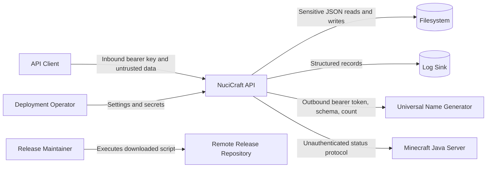

# Security Model

| Metadata | Value |
|----------|-------|
| Purpose | Document implemented security controls, trust boundaries, sensitive-data conduct, attack surfaces, and external operational assumptions. |
| Scope | Repository-visible authentication, authorisation, validation, secret use, network boundaries, persistence, logging, and package dependencies. |
| Primary sources | [Controllers](../NuciCraft.API/Controllers/), [Startup.cs](../NuciCraft.API/Startup.cs), [appsettings.json](../NuciCraft.API/appsettings.json), [PlayerService.cs](../NuciCraft.API/Service/PlayerService.cs), and [GetPlayerResponse.cs](../NuciCraft.API/Responses/GetPlayerResponse.cs) |
| Related documents | [Security policy](../SECURITY.md), [interfaces](interfaces.md), [configuration](configuration.md), and [error handling](error-handling.md) |

## Security Summary

The implemented access model is one service-wide API key supplied to every controller operation. It is not a Player identity, user session, role, or scope. Clients possessing the key can access every endpoint and every record exposed by those endpoints.

The process also uses a separate bearer token for outbound Universal Name Generator calls. Persistent and response data include highly sensitive fields. Security therefore depends substantially on secret injection, transport protection, filesystem permissions, log protection, and restricted network access supplied by deployment infrastructure.

## Trust Boundaries

Every arrow crosses a distinct trust or privilege boundary.

## Authentication

### Inbound

Every controller creates `NuciApiAuthorisation.ApiKey(SecuritySettings.ApiKey)` and passes it to `ProcessRequest`. Integration tests establish absent and invalid bearer values return `401`.

Exact key comparison, header parsing, HMAC relationship, timing behaviour, and error envelope are external NuciAPI package conduct.

The repository does not configure:
- ASP.NET Core authentication schemes.
- Cookie or session authentication.
- OAuth, OpenID Connect, JWT validation, or client certificates.
- Multiple active keys or rotation windows.
- Per-client identity.

### Outbound

MobService constructs bearer authorisation from `UniversalNameGeneratorSettings.ApiKey`. The inbound client key is not forwarded.

Minecraft status requires no credential.

## Authorisation

Authorisation is all-or-nothing at the API-key boundary. There is no endpoint role distinction and no ownership check based on the caller.

Examples:
- Any authorised client can retrieve all Players, including passwords and personal fields.
- Any authorised client can query another Player's Homes by identifier.
- Any authorised client can patch or delete any record for which an endpoint exists.
- Home `Player` is a data relationship, not caller identity.

`UseAuthorization` is present, but no local policy or `[Authorize]` usage adds another control.

## Secret Handling

Secret-bearing settings are:
- `securitySettings.apiKey`
- `universalNameGeneratorSettings.apiKey`

Committed [appsettings.json](../NuciCraft.API/appsettings.json) contains placeholders, not genuine values. Bracket placeholders are literals and must be overridden. [.gitignore](../.gitignore) excludes `.env`, but no `.env` loader is configured locally.

Controls implemented locally:
- Secrets are not hard-coded as genuine values.
- Generator token is passed as bearer authorisation rather than request content.
- Local service logging does not intentionally add password or API keys as LogInfo.

Controls absent locally:
- Key-strength validation.
- Rotation or revocation.
- Secret store integration.
- Redaction assurance in package request logging.
- Encrypted configuration.

## Sensitive Data

### Persisted

Player records can contain:
- Password.
- Last IP address.
- Discord identifier.
- E-mail address.
- Online and offline UUIDs.
- Moderation state and moderator names.
- Login, logout, sleep, demise, bed, and back locations.
- Skin URL and preferences.

Home, RTP, and Zone records contain world coordinates and ownership or leadership metadata.

### Returned

[GetPlayerResponse.cs](../NuciCraft.API/Responses/GetPlayerResponse.cs) returns Password, LastIpAddress, DiscordId, EmailAddress, moderation data, and location history to any authorised client. No redaction or purpose-limited response type exists.

### Cryptographic Protection

`PlayerService` stores the supplied password without local hashing or encryption. JSON stores have no local encryption at rest. TLS is expected in transit through HTTPS redirection and deployment, but transport termination and certificate correctness are external.

These are current implementation facts and material security risks.

## Input Validation

Implemented layers are:
- ASP.NET Core JSON parsing and data annotations.
- API-key processing through Nuci packages.
- Scanner-protection middleware supplied by Nuci API.
- Service-level domain validation.
- `Uri.EscapeDataString` for Zone map world query values.

Notable limitations are:
- Many optional strings accept empty or arbitrary content.
- URL fields are not URI-validated.
- Player patch timestamps are not validated before persistence.
- World spawn and Zone teleportation coordinates are not checked for finiteness.
- No request-rate limit or body-size policy is configured locally.
- No uniqueness enforcement exists for Player alternate identifiers.

## Output Encoding And Serialisation

ASP.NET Core and System.Text.Json serialise response content. No raw HTML rendering exists. Derived Zone MapLink escapes the teleportation World query value, while numeric values use invariant culture. BaseUrl itself is trusted configuration and concatenated directly.

HMAC ordering attributes indicate signed or canonicalised contract processing, but cryptographic enforcement is external. Duplicate HMAC order 27 on Player response Gender and Settings requires package-level verification.

## Network Security

### Inbound

`UseHttpsRedirection` is active. The repository does not define Kestrel certificates, reverse-proxy forwarded-header policy, HSTS, CORS, host filtering, or firewall rules. Integration tests supply `X-Forwarded-For`, but local startup does not explicitly register Forwarded Headers middleware.

### Outbound HTTP

The configured Universal Name Generator BaseUrl controls destination. No allowlist, certificate pinning, proxy policy, or local timeout exists. Protect configuration against server-side request redirection to unintended destinations.

### Outbound TCP

Server Hostname and Java port control an outbound TCP destination. They are operator settings, not request fields. No authentication or encryption exists in the legacy status protocol.

## Persistence Security

Implemented:
- `Data/` is excluded from Git.
- Stores are separated by domain and configurable path.

External assumptions:
- Operating-system access controls restrict files.
- Backups are encrypted and access-controlled as appropriate.
- Only one supported writer process accesses files.
- Storage disposal and retention satisfy operational policy.

No local file permission mode, encryption, integrity signature, tamper detection, secure erase, or record-level access exists.

## Logging Security

Service logs can include usernames, UUIDs, last IP addresses, coordinates, identifiers, and exceptions. Request-logging middleware may observe request metadata and potentially bodies according to package behaviour.

The repository does not implement redaction, retention, rotation, or audit access control. Operators must treat logs as sensitive and verify package configuration before enabling production file output.

## Privilege Boundaries

The process requires:
- Read and write access to seven store locations.
- Optional write access to log destination.
- Outbound HTTP access to the generator.
- Outbound TCP access to the Minecraft Java port.
- Inbound HTTP access on Kestrel's externally configured listener.

It does not require database, message broker, or Minecraft filesystem access. Deployment should grant only these necessary capabilities.

## External Attack Surfaces

| Surface | Existing Mitigation | Residual Risk |
|---------|---------------------|---------------|
| Public HTTP routes | API key, model validation, scanner middleware, HTTPS redirection | Single key compromise grants complete access; no local rate limit. |
| JSON parser and request models | ASP.NET Core parsing and Required/Range attributes | Broad strings and large collection values lack local limits. |
| JSON stores | Ignored by Git; operator permissions | Plaintext sensitive data, package write semantics, tampering. |
| Generator URL | Operator-controlled setting and bearer token | Misconfiguration, destination compromise, no local timeout or retry policy. |
| Minecraft host and port | Operator-controlled settings, fixed protocol timeout | Unauthenticated plaintext protocol and zero ambiguity. |
| Logs | Configurable file sink | Personal data exposure and package-defined request content. |
| Release script | HTTPS download | Mutable unpinned remote code executes with maintainer privileges. |

## Implemented Versus Assumed Controls

### Implemented In Repository

- API-key descriptor on every endpoint.
- HTTPS redirection.
- Scanner-protection middleware registration.
- Data-annotation and domain validation.
- Runtime-data Git exclusion.
- Separate outbound bearer credential.
- No genuine committed secret.

### Assumed External Controls

- Secure TLS termination and certificates.
- Protected secret injection and rotation.
- File and log permissions, encryption, backup, and retention.
- Network firewall and egress restriction.
- Process user least privilege.
- Monitoring and incident response.
- Inspection and integrity verification of release automation.

## Security Modification Guidance

- Treat response-field additions as disclosure decisions.
- Never add secrets, passwords, full personal records, or bearer headers to logs.
- Add per-identity authorisation only after defining a genuine caller identity independent of Player query selectors.
- Hashing existing passwords requires a data migration and authentication-contract design, not only a field transform.
- Verify every NuciAPI or NuciSecurity package upgrade with authorisation and error integration tests.
- Add outbound destination validation if configuration can be influenced beyond trusted operators.
- Revise [SECURITY.md](../SECURITY.md) when vulnerability scope or reporting policy changes.
