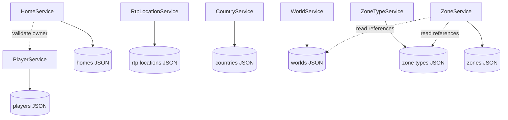
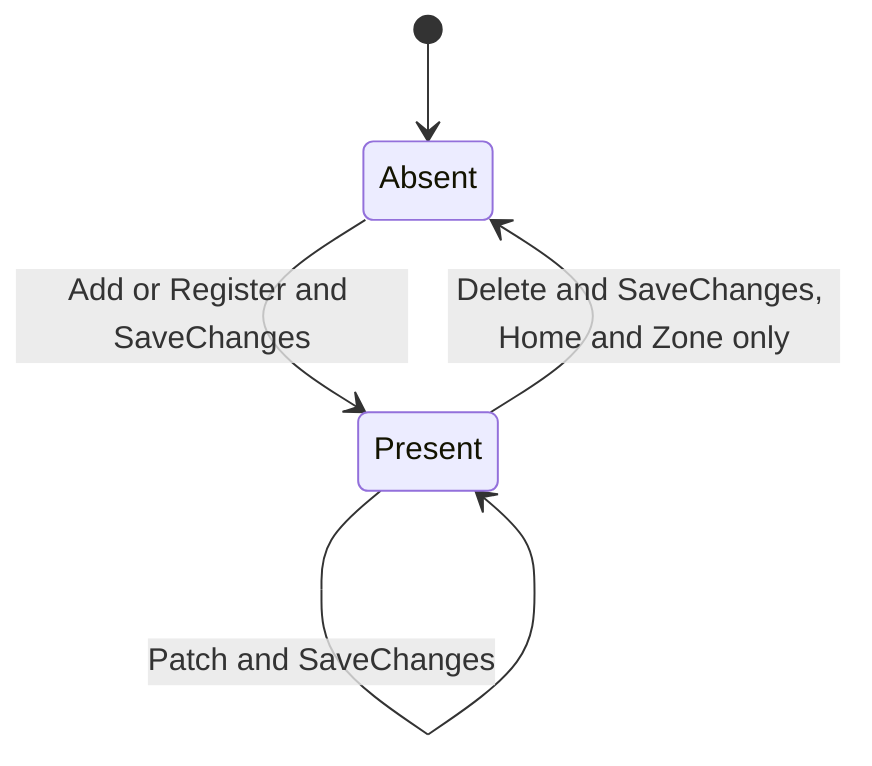

# State And Persistence

| Metadata | Value |
|----------|-------|
| Purpose | Describe all persistent, in-memory, derived, configuration, and external state, including ownership, lifecycle, transitions, consistency, and invalidation. |
| Scope | Runtime state visible from local implementation and externally supplied repository boundaries. |
| Primary sources | [Startup.cs](../NuciCraft.API/Startup.cs), [ServiceCollectionExtensions.cs](../NuciCraft.API/ServiceCollectionExtensions.cs), [DataAccess/DataObjects](../NuciCraft.API/DataAccess/DataObjects/), and all concrete services under [Service](../NuciCraft.API/Service/) |
| Related documents | [Persistence component](components/persistence-and-mapping.md), [data model](data-model.md), [architecture](architecture.md), and [invariants](invariants.md) |

## State Inventory

| State | Location | Owner | Lifetime |
|-------|----------|-------|----------|
| Player records | Configured JSON file | PlayerService and Player repository | Until file replacement or deletion. |
| Home records | Configured JSON file | HomeService and Home repository | Until deleted through API or file replacement. |
| RTP records | Configured JSON file | RtpLocationService and RTP repository | Append-only through current API. |
| Country records | Configured JSON file | CountryService and Country repository | No API deletion. |
| World records | Configured JSON file | WorldService and World repository | No API deletion. |
| ZoneType records | Configured JSON file | ZoneTypeService and ZoneType repository | No API deletion. |
| Zone records | Configured JSON file | ZoneService and Zone repository | Until API deletion or file replacement. |
| Bound settings | Singleton objects and static DataStoreSettings reference | Composition root | Process lifetime. |
| Service and repository instances | DI singleton graph | Service provider | Process lifetime. |
| Home monitor lock | HomeService field | HomeService | Process lifetime. |
| Derived Zone MapLink | Returned Zone model | ZoneService read operation | Response duration. |
| Generated mob names | Remote response and HTTP response | MobService operation | Request duration. |
| Server status | MineStat instance and response | ServerStatusService operation | Request duration. |
| Logs | Configured NuciLog sink | NuciLog and operator | Package and operator-defined. |

## Filesystem Persistence

### Store Topology

Each root data-object type has one independent file and one singleton repository. Default files reside beneath ignored local `Data/`, but production can override every path independently.

### Initial State

An absent store becomes a file containing an empty JSON array. An existing store is preserved and must be materialisable by its repository. No seeded source-controlled records exist because `Data/` is ignored.

### Save Boundaries

Every successful mutation calls `SaveChanges` directly after Add, Update, or Remove. There is no deferred unit of work spanning an HTTP request and no shared transaction among repositories.

### Consistency Model

Locally confirmed guarantees are limited:
- Service methods sequence reads, validation, mutation, and save synchronously.
- Home operations are serialised within one HomeService instance.
- Restart persistence is verified for World and revised Home records.

Not locally established:
- Atomicity of one JSON file write.
- Durability at operating-system or storage-device level when SaveChanges returns.
- Isolation among non-Home concurrent requests.
- Multi-process consistency.
- External file edit visibility.
- Recovery from partial writes.

## Aggregate State Transitions

Capability differences are:
- Player, Country, World, and ZoneType have no deletion transition through current interfaces.
- RTP has neither patch nor deletion transitions.
- Home and Zone support the complete create, patch, delete progression.
- External names and status never enter persistent state.

## Player State

Registration establishes generated identifier, deterministic offline UUID, creation timestamp, identity and personal fields, optional activity state, and default settings. Patch changes selected fields and adds UpdatedDT.

Username and UUID duplicates are not prevented locally. Alternate selectors can consequently cease to identify a logically unique record even when repository Id remains unique.

Patch timestamp strings can enter invalid state because update does not parse them. Such state can become unreadable during mapping.

## Home State

A Home is owned by a stored Player identifier and has generated id, immutable CreatedDT, nullable UpdatedDT, localised Name, and Location.

The process-local lock protects:
- Reads.
- Duplicate scans.
- Owner validation calls.
- Add, update, remove, and save.

It therefore prevents same-process Home interleaving through `HomeService`. It cannot protect direct repository access, another process, or external file writes.

Home update builds a mapped candidate, validates the resulting state, then passes it to repository Update. Failure before Update leaves the intended persisted record unchanged under normal detached mapping semantics.

## RTP State

RTP records accumulate. Addition reads existing state twice, validates thresholds, then appends and saves. Because no lock spans those scans and write, concurrent additions can violate separation after both validate against the identical prior collection.

Changing configured thresholds does not revise or mark existing records. Selection neither removes nor reserves a result.

## Geographic State

Country, World, and ZoneType modifications are independent. Zone uses soft references:
- World and Type are validated on Zone add and supplied patches.
- Existing Zones are not updated when referenced metadata changes.
- There is no World or ZoneType deletion API.

Zone Bounds are canonicalised on writes and again on reads. Old non-canonical persisted bounds therefore produce canonical responses even without explicit save. The service assigns canonical Bounds to the returned data object, but whether this changes package-retained repository state is indeterminate.

Derived MapLink is not persistence state. It changes when WebMap BaseUrl, World HasWebMap, Zone World, or TeleportationPoint changes and requires no invalidation operation.

## Configuration State

Six application settings objects are created and bound once. The static `ServiceCollectionExtensions.dataStoreSettings` reference and registered instance refer to the constructed object. No monitor updates them.

Configuration changes require process restart for a supported effect. A store-path revision changes the selected state set; the application performs no migration between old and new paths.

## Caches And Invalidation

No explicit application cache exists. Potential repository-internal retention belongs to NuciDAL and is not visible locally. There is no cache invalidation API.

The application performs live remote calls for names and server status on every request. No stale response can be returned from a local cache.

## Distributed State

There is no distributed lock, consensus, queue, cache, transaction coordinator, or shared version token. Multiple processes pointed at identical files are not a documented supported writer topology. Multiple processes pointed at distinct files have independent divergent state.

## Backup, Restore, And Migration

The repository implements none of these operations. Operators must coordinate file copies with write activity, protect personal and credential data, and validate restored JSON by starting or otherwise materialising repositories.

An incompatible data-object change requires a separately designed migration. Startup only creates absent empty files and cannot transform existing records.

## State Failure Modes

| Failure | Possible State |
|---------|----------------|
| Validation before mutation | Intended persisted state unchanged. |
| Repository Add or Update failure | Package-dependent in-memory state; file outcome unknown locally. |
| SaveChanges failure | In-memory mutation may exist; durable file outcome unknown locally. |
| Cross-store reference succeeds, target save fails | Reference stores unchanged; target state uncertain by repository failure point. |
| Process terminates after successful save | Restart tests establish selected state survives ordinary restart. |
| External file corruption | Next materialisation can fail startup or request. |
| External file replacement while running | Visibility depends on NuciDAL implementation. |

## Modification Rules

- Preserve one explicit save for each intended mutation.
- Treat data-object field changes as persisted contract changes.
- Add migration before incompatible deployment.
- Define concurrency and atomicity explicitly when replacing persistence.
- Do not treat local `Data/` content as source fixtures.
- Add restart-persistence coverage for novel aggregate types or shape changes.
